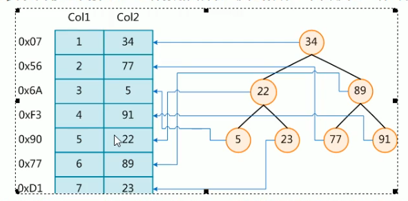
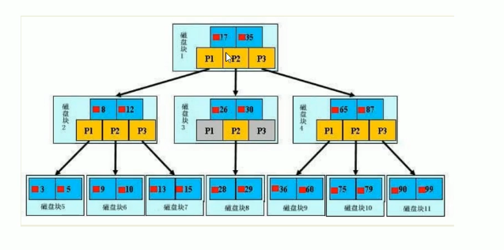

# MySQL高级

[[TOC]]

## MySQL逻辑架构


和其他数据库相比，MYSQL有点与众不同，它的架构可以在多种不同场景中应用并发挥良好作用。主要提现在存储引擎的架构上，
**插件式的存储引擎架构将查询处理和其他的系统任务以及数据的存储提取相分离**。这种架构可以根据业务的需求和实际需要选择合适的引擎。

## MySQL存储引擎
MySQL存储引擎有近十种，最常用的两种分别是MyISAM和InnoDB.

- 查看sql现在都有什么存储引擎
``` sql
show engines;
```

- 查看sql当前默认的存储引擎
``` sql
show varizbles like '%storage_engine%';
```


### MyISAM和InnoDB

对比项|MyISAM|InnoDB|
---|:--:|---:|
主外键|不支持|支持|
事务|不支持|支持|
行表锁|表锁，即使操作一条记录也会锁住整个表，不适合高并发的操作|行锁，操作时只锁某一行，不对其他行有影响，**适合高并发操作**|
缓存|之缓存索引，不缓存真实数据|不仅缓存索引还要缓存真实数据，对内存要求较高，而且内存大小对性能有决定性的影响。|
表空间|小|大|
关注点|性能|事务|

## 优化分析

### 性能下降SQL慢&执行时间长&等待时间长

- 查询语句写的烂
- 索引失效(单值索引、复合索引)
- 关联查询太多join(设计缺陷或不得已的需求)
- 服务器调优及各个参数设置(缓冲、线程数等)

### 常见通用的join查询

#### SQL执行顺序

**注意sql是从from开始执行的**
**手写**：
``` sql
SELECT DISTINCT <select_list> 
==> FROM <left_table> <join_type> 
==> JOIN <right_table> ON <join_condition>
==> WHERE <where_condition> 
==>GROUP BY <group_by_list> 
==>HAVING <having_condition> 
==>ORDER BY <order_by_condition> 
==>LIMIT <limit number>
```
**机读**：FROM->ON->WHERE->GROUP BY->HAVING->SELECT->DISTINCT->ORDER BY->LIMIT


#### 七种Join理论

- 内连接 inner join


``` sql
SELECT <select_list> FROM TableA A INNER JOIN TableB B ON A.Key = B.Key
```
- 左连接 left join


``` sql
SELECT <select_list> FROM TableA A LEFT JOIN TableB B ON A.Key = B.Key
```
- 右连接 right join


``` sql
SELECT <select_list> FROM TableA A RIGHT JOIN TableB B ON A.Key = B.Key
```

- 左连接 left join is null


``` sql
SELECT <select_list> FROM TableA A LEFT JOIN TableB B ON A.Key = B.Key WHERE B.Key IS NULL.
```

- 右连接 right join is null


``` sql
SELECT <select_list> FROM TableA A RIGHT JOIN TableB B ON A.Key = B.Key WHERE B.Key IS NULL.
```
- 全连接 full outer join 


``` sql
SELECT <select_list> FROM TableA A FULL OUTER JOIN TableB B ON A.Key = B.Key
```
**sql不支持，oracle支持**

所以可以使用union连接两个语句
``` sql
SELECT <select_list> FROM TableA A LEFT JOIN TableB B ON A.Key = B.Key union 
SELECT <select_list> FROM TableA A RIGHT JOIN TableB B ON A.Key = B.Key
```

- 全连接 full outer join is null


``` sql
SELECT <select_list> FROM TableA A FULL OUTER JOIN TableB B ON A.Key = B.Key WHERE B.Key IS NULL.
```
使用union连接两个语句
``` sql
SELECT <select_list> FROM TableA A LEFT JOIN TableB B ON A.Key = B.Key WHERE B.Key IS NULL union 
SELECT <select_list> FROM TableA A RIGHT JOIN TableB B ON A.Key = B.Key WHERE B.Key IS NULL
```
## 索引

### 索引的定义

MySQL官方对索引的定义为：索引(Index)是帮助MySQL高效获取数据的数据结构。其本质是一种数据结构

**可以简单理解为排好序的快速查找的数据结构**,用于快速查找和排序。

索引的目的在于提高查询效率，可以类比字典。

索引可以影响到where语句后的查找和order by语句后的排序，这两大功能查找和排序都会有影响

若没有索引则会全扫描进行查找。

::: tip 索引详解
在数据之外，**数据库系统还维护着满足特定查找算法的数据结构**，这些数据结构以某种方式引用(指向)数据，
这样就可以在这些数据结构上实现高级查找算法。这种数据结构，就是索引。
:::

下图就是一种可能的索引方式示例：



为了加快Col2的查找，可以维护一个右边所示的二叉查找树，每个节点分别包含索引键值和一个指向对应数据记录
物理地址的指针，这样就可以运用二叉查找在一定的复杂度内获取到对应数据，从而快速的检索出符合条件的记录。

之所以要逻辑删除，而不进行物理删除，一是为了索引，二是为了共享数据(大数据，数据分析等)

::: tip 总结
一般来说索引本身也很大，不可能全部存储在内存中，因此索引往往以索引文件的形式存储在磁盘上。

我们平常所说的索引，如果没有特别指明，都是指B树(多路搜索树，并不一定是二叉的)结构组织的索引。

其中聚集索引，次要索引，复合索引，前缀索引，唯一索引默认都是使用B+树索引，统称索引。当然，除了B+树这种类型
的索引之外，还有哈希索引(hash index)等。
:::

### 索引优势

- 类似图书馆建书目索引，**提高数据检索的效率**，降低数据库的IO成本
- 通过索引列对数据进行排序，**降低数据排序的成本**，降低了CPU的消耗。

### 索引劣势

- 实际上索引也是一张表，该表保存了主键与索引字段，并指向实体表的记录，所以索引列也是要占用空间的。

- 虽然索引大大提高了查询速度，同时却会降低更新表的速度，如对表进行INSERT、UPDATE和DELETE。
因为更新表时，MySQL不仅要保存数据，还要保存一下索引文件每次更新添加了索引列的字段，
都会调整因为更新所带来的键值变化后的索引信息。

- 索引只是提高效率的一个因素，如果你的MySQL有大数据量的表，就需要花时间研究建立最优秀的索引，
或优化查询

### 索引分类

- 单值索引:即一个索引只包含单个列，一个表可以有多个单列索引
建议：索引最多不超过5个

- 唯一索引：索引列的值必须唯一，但允许有空值

- 复合索引:即一个索引包含多个列

::: tip 基本语法
- 创建 
``` sql
CREATE [UNIQUE] INDEX indexName ON table(columnname(length));
ALTER mytable ADD [UNIQUE] INDEX [indexName] ON (columnname(length));
```
- 删除
``` sql
DROP INDEX [indexName] ON mytable;
```
- 查看
``` sql
SHOW INDEX FROM table_name\G
```

有四种方式来添加数据表的索引:.

- `ALTER TABLE tbl_name ADD PRIMARY KEY(colum_list)`该语句添加一个主键，这意味着索引值必须是唯一的，且不能为NULL.

- `ALTER TABLE tbl_name ADD UNIQUE index_name(colum_list)` 这条语句创建索引的值必须是唯一的（除了NULL外，NULL可能会出现多次）。

- `ALTER TABLE tbl_name ADD INDEX index_name(colum_list)` 添加普通索引，索引值可出现多次。

- `ALTER TABLE tbl_name ADD FULLTEXT index_name (colum_list)` 该语句指定了索引为FULLTEXT,用于全文索引。
:::

### 索引结构

- BTree索引

**检索原理**



【初始化介绍】：
一颗b+树，浅蓝色的块我们称之为一个磁盘块，可以看到每个磁盘块包含几个数据项(深蓝色所示)和指针(黄色所示)，
如磁盘块1包含数据项17和36，包含指针P1、P2、P3，
P1表示小于17的磁盘块，P2表示在17和35之间的磁盘块，P3表示大于35的磁盘块。
**真实的数据存在于叶子节点**即3、5、9、10、13、15、28、29、36、60、75、79、90、99.
**非叶子节点不存储真实的数据，只存储指引搜索方向的数据项**，如17、35并不真实存在于数据表中。

【查找过程】
如果要查找数据项29，那么首先会把磁盘块1由磁盘加载到内存，此时发生一次IO
在内存中用二分查找确定29在17和35之间，锁定磁盘块1的P2指针，内存时间因为非常短
(相比磁盘的IO)可以忽略不计，通过磁盘块1的P2指针的磁盘地址把磁盘块3由磁盘加载到内存，
发生第二次IO,29在26和30之间，锁定磁盘块3的P2指针，通过指针加载磁盘块8到内存，发生第三次IO,
同时内存中做二分查找找到29，结束查询，总计三次IO.

真实的情况是，3层的b+树可以表示上百万的数据，如果上百万的数据查找只需要三次IO,性能提高将是巨大
的，如果没有索引，每个数据项都要发生一次IO,那么总共需要百万次的IO,显然成本非常非常高。


- Hash索引

- full-text全文索引

- R-Tree索引

### 哪些情况需要创建索引
1.主键自动建立唯一索引

2.频繁作为查询条件的字段应该创建索引

3.查询中与其他表关联的字段，外键关系建立索引

4.频繁更新的字段不适合创建索引==> 因为每次更新不单单是更新了记录还会更新索引，加重了IO负担。

5.Where条件里用不到的字段不创建索引

6.单键/组合索引的选择问题，who？(在高并发下倾向创建组合索引)

7.查询中排序的字段，排序字段若通过索引去访问将大大提高排序速度

8.查询中统计或者分组字段
### 哪些情况不需要创建索引
1.表记录太少(差不多300w的数据，性能降低)

2.经常增删改的表
>Why:提高了查询速度，同时却会降低更新表的速度，如对表进行INSERT、UPDATE和DELETE。
>因为更新表时，MySQL不仅要保存数据，还要保存索引文件。

3.数据重复且分布平均的表字段，因此应该只为最经常查询和最经常排序的数据列建立索引。
注意，如果某个数据列包含许多重复的内容，为它建立索引就没有太大的实际效果。

## 性能分析

### MySql Query Optimizer (MySql查询优化器)

### MySQL常见瓶颈

- CPU:CPU在饱和的时候一般发生在数据装入内存或从磁盘上读取数据的时候

- IO:磁盘I/O发生在装入数据远大于内存容量的时候

- 服务器硬件的性能瓶颈:top,free,iostat和vmstat来查看系统的性能状态

### Explain


 


