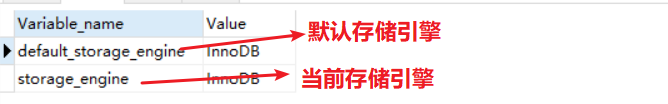

# MySQL高级

## MySQL逻辑架构


和其他数据库相比，MYSQL有点与众不同，它的架构可以在多种不同场景中应用并发挥良好作用。主要提现在存储引擎的架构上，
**插件式的存储引擎架构将查询处理和其他的系统任务以及数据的存储提取相分离**。这种架构可以根据业务的需求和实际需要选择合适的引擎。

## MySQL存储引擎
MySQL存储引擎有近十种，最常用的两种分别是MyISAM和InnoDB.

- 查看mysql现在都有什么存储引擎
``` mysql
show engines;
```

- 查看mysql当前默认的存储引擎
``` mysql
show varizbles like '%storage_engine%';
```


### MyISAM和InnoDB

对比项|MyISAM|InnoDB
---|:--:|---:
主外键|不支持|支持
事务|不支持|支持
行表锁|表锁，即使操作一条记录也会锁住整个表，不适合高并发的操作|行锁，操作时只锁某一行，不对其他行有影响，**适合高并发操作**
缓存|之缓存索引，不缓存真实数据|不仅缓存索引还要缓存真实数据，对内存要求较高，而且内存大小对性能有决定性的影响。
表空间|小|大
关注点|性能|事务

## 优化分析

### 性能下降SQL慢&执行时间长&等待时间长

- 查询语句写的烂
- 索引失效(单值索引、复合索引)
- 关联查询太多join(设计缺陷或不得已的需求)
- 服务器调优及各个参数设置(缓冲、线程数等)

### 常见通用的join查询

#### SQL执行顺序

**注意sql是从from开始执行的**
**手写**：SELECT DISTINCT <select_list> ==> FROM <left_table> <join_type> ==> JOIN <right_table> ON <join_condition>
==> WHERE <where_condition> ==>GROUP BY <group_by_list> ==>HAVING <having_condition> ==>ORDER BY <order_by_condition> ==>LIMIT <limit number>

**机读**：FROM->ON->WHERE->GROUP BY->HAVING->SELECT->DISTINCT->ORDER BY->LIMIT


#### 七种Join理论

- 内连接 inner join


``` mysql
SELECT <select_list> FROM TableA A INNER JOIN TableB B ON A.Key = B.Key
```
- 左连接 left join


``` mysql
SELECT <select_list> FROM TableA A LEFT JOIN TableB B ON A.Key = B.Key
```
- 右连接 right join


``` mysql
SELECT <select_list> FROM TableA A RIGHT JOIN TableB B ON A.Key = B.Key
```

- 左连接 left join is null


``` mysql
SELECT <select_list> FROM TableA A LEFT JOIN TableB B ON A.Key = B.Key WHERE B.Key IS NULL.
```

- 右连接 right join is null


``` mysql
SELECT <select_list> FROM TableA A RIGHT JOIN TableB B ON A.Key = B.Key WHERE B.Key IS NULL.
```
- 全连接 full outer join


``` mysql
SELECT <select_list> FROM TableA A FULL OUTER JOIN TableB B ON A.Key = B.Key
```

- 全连接 full outer join is null


``` mysql
SELECT <select_list> FROM TableA A FULL OUTER JOIN TableB B ON A.Key = B.Key WHERE B.Key IS NULL.
```


 


