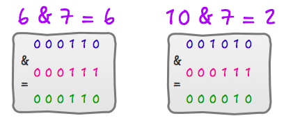
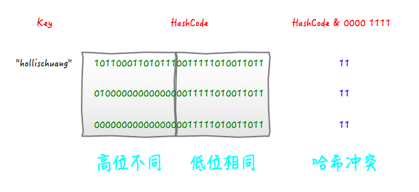

# Hash()方法

>本文将详细分析各种常见得hash()的实现。

[[TOC]]

::: warning 带着问题理解
- HashMap中hash方法的具体实现？
- HashTable、ConcurrentHashMap中hash方法的实现以及原因？为什么要这么实现？
- 为什么HashMap中初始容量是16，并且每次扩容是原来的2倍？
- 为什么JDK 7和JDK 8中hash方法实现的不同以及区别
:::

## 哈希

Hash,一般翻译做“散列”，也有直接音译为“哈希”的，就是

**通过散列算法,把任意长度的输入变换成固定长度的输出，该输出就是散列值.**

这种转换是一种压缩映射，也就是，散列值的空间通常远小于输入的空间，不同的输入可能会散列成相同的输出，所以不可能从散列值来唯一的确定输入值。
简单的说就是一种将任意长度的消息压缩到某一固定长度的消息摘要的函数。

所有**散列函数**都有如下一个**基本特性**：根据同一散列函数计算出的散列值如果不同，那么输入值肯定也不同。但是，根据同一散列函数计算出的散列值如果相同，输入值不一定相同。

两个不同的输入值，根据同一散列函数计算出的散列值相同的现象叫做**碰撞**。

常见的Hash函数有以下几个：

- **直接定址法**：直接以关键字k或者k加上某个常数（k+c）作为哈希地址。

- **数字分析法**：提取关键字中取值比较均匀的数字作为哈希地址。

- **除留余数法**：用关键字k除以某个不大于哈希表长度m的数p，将所得余数作为哈希表地址。

- **分段叠加法**：按照哈希表地址位数将关键字分成位数相等的几部分，其中最后一部分可以比较短。然后将这几部分相加，舍弃最高进位后的结果就是该关键字的哈希地址。

- **平方取中法**：如果关键字各个部分分布都不均匀的话，可以先求出它的平方值，然后按照需求取中间的几位作为哈希地址。

- **伪随机数法**：采用一个伪随机数当作哈希函数。

上面介绍过碰撞。**衡量一个哈希函数的好坏的重要指标就是发生碰撞的概率以及发生碰撞的解决方案**。任何哈希函数基本都无法彻底避免碰撞，常见的解决碰撞的方法有以下几种：

- **开放定址法**：开放定址法就是一旦发生了冲突，就去寻找下一个空的散列地址，只要散列表足够大，空的散列地址总能找到，并将记录存入。

- **链地址法**：将哈希表的每个单元作为链表的头结点，所有哈希地址为i的元素构成一个同义词链表。即发生冲突时就把该关键字链在以该单元为头结点的链表的尾部。

- **再哈希法**：当哈希地址发生冲突用其他的函数计算另一个哈希函数地址，直到冲突不再产生为止。

- **建立公共溢出区**：将哈希表分为基本表和溢出表两部分，发生冲突的元素都放入溢出表中。


## HashMap 的数据结构

在Java中，保存数据有两种比较简单的数据结构：数组和链表。

数组的特点是：寻址容易，插入和删除困难；而链表的特点是：寻址困难，插入和删除容易。

常用的哈希函数的冲突解决办法中有一种方法叫做链地址法，其实就是将数组和链表组合在一起，发挥了两者的优势，我们可以将其理解为链表的数组。


我们可以从上图看到，左边很明显是个数组，数组的每个成员是一个链表。该数据结构所容纳的所有元素均包含一个指针，用于元素间的链接。
我们根据元素的自身特征把元素分配到不同的链表中去，反过来我们也正是通过这些特征找到正确的链表，再从链表中找出正确的元素。
其中，**根据元素特征计算元素数组下标的方法就是哈希算法**，即本文的主角hash()函数（当然，还包括indexOf()函数）。

## hash()方法

我们拿JDK 1.7的HashMap为例，其中定义了一个final int hash(Object k) 方法，其主要被以下方法引用。

 方法")

上面的方法主要都是增加和删除方法，这不难理解，当我们要对一个链表数组中的某个元素进行增删的时候，首先要知道他应该保存在这个链表数组中的哪个位置，即他在这个数组中的下标。

而**hash()方法的功能就是根据Key来定位其在HashMap中的位置**。HashTable、ConcurrentHashMap同理。

## 源码解析

首先，在同一个版本的Jdk中，HashMap、HashTable以及ConcurrentHashMap里面的hash方法的实现是不同的。再不同的版本的JDK中（Java7 和 Java8）中也是有区别的

在上代码之前，我们先来做个简单分析。我们知道，**hash方法的功能是根据Key来定位这个K-V在链表数组中的位置的**。
也就是hash方法的输入应该是个Object类型的Key，输出应该是个int类型的数组下标。如果让你设计这个方法，你会怎么做？

其实简单，我们只要**调用Object对象的hashCode()方法**，该方法会返回一个整数，然后用这个数对HashMap或者HashTable的容量进行取模就行了。没错，其实基本原理就是这个，
只不过，在具体实现上，由两个方法int hash(Object k)和int indexFor(int h, int length)来实现。但是考虑到效率等问题，HashMap的实现会稍微复杂一点。

>hash ：该方法主要是将Object转换成一个整型。
>
>indexFor ：该方法主要是将hash生成的整型转换成链表数组中的下标。

## HashMap In Java 7

``` java
final int hash(Object k) {
    int h = hashSeed;
    if (0 != h && k instanceof String) {
        return sun.misc.Hashing.stringHash32((String) k);
    }

    h ^= k.hashCode();
    h ^= (h >>> 20) ^ (h >>> 12);
    return h ^ (h >>> 7) ^ (h >>> 4);
}

static int indexFor(int h, int length) {
    return h & (length-1);
}
```
前面说过，**indexFor方法其实主要是将hash生成的整型转换成链表数组中的下标**。

那么return h & (length-1);是什么意思呢？其实，他就是取模。

Java之所有使用位运算(&)来代替取模运算(%)，最主要的考虑就是**效率**。**位运算(&)效率要比代替取模运算(%)高很多**，
<u>主要原因是位运算直接对内存数据进行操作，不需要转成十进制，因此处理速度非常快。</u>

那么，为什么可以使用位运算(&)来实现取模运算(%)呢？这实现的原理如下:

>X % 2^n = X & (2^n – 1)
>
>2^n表示2的n次方，也就是说，一个数对2^n取模 == 一个数和(2^n – 1)做按位与运算 。
>    
>假设n为3，则2^3 = 8，表示成2进制就是1000。2^3 = 7 ，即0111。
>     
>此时X & (2^3 – 1) 就相当于取X的2进制的最后三位数。
>    
>从2进制角度来看，X / 8相当于 X >> 3，即把X右移3位，此时得到了X / 8的商，而被移掉的部分(后三位)，则是X % 8，也就是余数。

上面的解释不知道你有没有看懂，没看懂的话其实也没关系，你只需要记住这个技巧就可以了。或者你可以找几个例子试一下。

>    6 % 8 = 6 ，6 & 7 = 6
>
>    10 & 8 = 2 ，10 & 7 = 2



所以，return h & (length-1)就是h对(length-1的取模运算);只要保证length的长度是2^n的话，就可以实现取模运算了。
**而HashMap中的length也确实是2的倍数，初始值是16，之后每次扩充为原来的2倍。**-->为什么HashMap中初始容量是16，并且每次扩容是原来的2倍？

::: tip 总结
分析完indexFor方法后，我们接下来准备分析hash方法的具体原理和实现。在深入分析之前，至此，先做个总结。

HashMap的数据是存储在链表数组里面的。在对HashMap进行插入/删除等操作时，都需要根据K-V对的键值定位到他应该保存在数组的哪个下标中。
而这个通过键值求取下标的操作就叫做哈希。HashMap的数组是有长度的，Java中规定这个长度只能是2的倍数，初始值为16。
简单的做法是先求取出键值的hashcode，然后在将hashcode得到的int值对数组长度进行取模。为了考虑性能，**Java总采用按位与操作实现取模操作**。
:::

接下来我们会发现，无论是用取模运算还是位运算都无法直接解决冲突较大的问题。比如：CA11 0000和0001 0000在对0000 1111进行按位与运算后的值是相等的。


两个不同的键值，在对数组长度进行按位与运算后得到的结果相同，这不就发生了冲突吗。那么如何解决这种冲突呢，来看下Java是如何做的。

其中的主要代码部分如下：

``` java
h ^= k.hashCode();
h ^= (h >>> 20) ^ (h >>> 12);
return h ^ (h >>> 7) ^ (h >>> 4);
```
这段代码是为了对key的hashCode进行扰动计算，**防止不同hashCode的高位不同但低位相同导致的hash冲突**。

简单点说，就是为了把高位的特征和低位的特征组合起来，降低哈希冲突的概率，也就是说，尽量做到任何一位的变化都能对最终得到的结果产生影响。

举个例子来说，我们现在想向一个HashMap中put一个K-V对，Key的值为“hollischuang”，经过简单的获取hashcode后，得到的值为“1011000110101110011111010011011”，如果当前HashTable的大小为16，
即在不进行扰动计算的情况下，他最终得到的index结果值为11。由于15的二进制扩展到32位为“00000000000000000000000000001111”，所以，一个数字在和他进行按位与操作的时候，
前28位无论是什么，计算结果都一样（因为0和任何数做与，结果都为0）。如下图所示。



可以看到，后面的两个hashcode经过位运算之后得到的值也是11 ，虽然我们不知道哪个key的hashcode是上面例子中的那两个，但是肯定存在这样的key，这就产生了冲突。

那么，接下来，我看看一下经过扰动的算法最终的计算结果会如何


从上面图中可以看到，之前会产生冲突的两个hashcode，经过扰动计算之后，最终得到的index的值不一样了，这就很好的避免了冲突。

::: warning 拓展
其实，**使用位运算代替取模运算，除了性能之外，还有一个好处就是可以很好的解决负数的问题**。因为我们知道，hashcode的结果是int类型，而int的取值范围是-2^31 ~ 2^31 – 1，
即[ -2147483648, 2147483647]；这里面是包含负数的，我们知道，对于一个负数取模还是有些麻烦的。如果使用二进制的位运算的话就可以很好的避免这个问题。
首先，不管hashcode的值是正数还是负数。length-1这个值一定是个正数。那么，他的二进制的第一位一定是0（有符号数用最高位作为符号位，“0”代表“+”，“1”代表“-”），
这样里两个数做按位与运算之后，第一位一定是个0，也就是，得到的结果一定是个正数。
:::

## HashTable In Java 7

上面是Java 7中HashMap的hash方法以及indexOf方法的实现，那么接下来我们要看下，线程安全的HashTable是如何实现的，和HashMap有何不同，并试着分析下不同的原因。
以下是Java 7中HashTable的hash方法的实现。

``` java
private int hash(Object k) {
    // hashSeed will be zero if alternative hashing is disabled.
    return hashSeed ^ k.hashCode();
}
```

我们可以发现，很简单，相当于只是对k做了个简单的hash，取了一下其hashCode。而HashTable中也没有indexOf方法，取而代之的是这段代码：int index = (hash & 0x7FFFFFFF) % tab.length;。
也就是说，HashMap和HashTable对于计算数组下标这件事，采用了两种方法。**HashMap采用的是位运算**，而**HashTable采用的是直接取模**。
::: danger 注意
为啥要把hash值和0x7FFFFFFF做一次按位与操作呢，主要是为了保证得到的index的第一位为0，也就是为了得到一个正数。因为有符号数第一位0代表正数，1代表负数。
:::

我们前面说过，HashMap之所以不用取模的原因是为了提高效率。有人认为，因为HashTable是个线程安全的类，本来就慢，所以Java并没有考虑效率问题，就直接使用取模算法了呢？但是其实并不完全是，
Java这样设计还是有一定的考虑在的，虽然这样效率确实是会比HashMap慢一些。

其实，HashTable采用简单的取模是有一定的考虑在的。这就要涉及到HashTable的构造函数和扩容函数了。由于篇幅有限，这里就不贴代码了，直接给出结论：

::: tip 结论
HashTable默认的初始大小为11，之后每次扩充为原来的2n+1。

也就是说，HashTable的链表数组的默认大小是一个素数、奇数。之后的每次扩充结果也都是奇数。

由于HashTable会尽量使用素数、奇数作为容量的大小。当哈希表的大小为素数时，简单的取模哈希的结果会更加均匀。（这个是可以证明出来的，由于不是本文重点，暂不详细介绍，可参考：http://zhaox.github.io/algorithm/2015/06/29/hash）
:::

至此，我们看完了Java 7中HashMap和HashTable中对于hash的实现，我们来做个简单的总结。

::: tip 总结
- HashMap默认的初始化大小为16，之后每次扩充为原来的2倍。
- HashTable默认的初始大小为11，之后每次扩充为原来的2n+1。
- 当哈希表的大小为素数时，简单的取模哈希的结果会更加均匀，所以单从这一点上看，HashTable的哈希表大小选择，似乎更高明些。因为hash结果越分散效果越好。
- 在取模计算时，如果模数是2的幂，那么我们可以直接使用位运算来得到结果，效率要大大高于做除法。所以从hash计算的效率上，又是HashMap更胜一筹。
- 但是，HashMap为了提高效率使用位运算代替哈希，这又引入了哈希分布不均匀的问题，所以HashMap为解决这问题，又对hash算法做了一些改进，进行了扰动计算。
:::

## ConcurrentHashMap In Java 7

``` java
private int hash(Object k) {
    int h = hashSeed;

    if ((0 != h) && (k instanceof String)) {
        return sun.misc.Hashing.stringHash32((String) k);
    }

    h ^= k.hashCode();

    // Spread bits to regularize both segment and index locations,
    // using variant of single-word Wang/Jenkins hash.
    h += (h <<  15) ^ 0xffffcd7d;
    h ^= (h >>> 10);
    h += (h <<   3);
    h ^= (h >>>  6);
    h += (h <<   2) + (h << 14);
    return h ^ (h >>> 16);
}

int j = (hash >>> segmentShift) & segmentMask;
```
上面这段关于ConcurrentHashMap的hash实现其实和HashMap如出一辙。都是通过位运算代替取模，然后再对hashcode进行扰动。区别在于，ConcurrentHashMap 使用了一种变种的Wang/Jenkins 哈希算法，
其**主要目的也是为了把高位和低位组合在一起，避免发生冲突**。至于为啥不和HashMap采用同样的算法进行扰动，我猜这只是程序员自由意志的选择吧。至少我目前没有办法证明哪个更优。

## HashMap In Java 8

在Java 8 之前，HashMap和其他基于map的类都是通过链地址法解决冲突，它们使用单向链表来存储相同索引值的元素。在最坏的情况下，这种方式会将HashMap的get方法的性能从O(1)降低到O(n)。

为了解决在频繁冲突时hashmap性能降低的问题，Java 8中使用**平衡树**来替代链表存储冲突的元素。这意味着我们可以**将最坏情况下的性能从O(n)提高到O(logn)**.

如果恶意程序知道我们用的是Hash算法，则在纯链表情况下，它能够发送大量请求导致哈希碰撞，然后不停访问这些key导致HashMap忙于进行线性查找，最终陷入瘫痪，即形成了拒绝服务攻击（DoS）。

关于Java 8中的hash函数，原理和Java 7中基本类似。Java 8中这一步做了优化，只做一次16位右位移异或混合，而不是四次，但原理是不变的。

``` java
static final int hash(Object key) {
    int h;
    return (key == null) ? 0 : (h = key.hashCode()) ^ (h >>> 16);
}
```
在JDK1.8的实现中，优化了高位运算的算法，通过hashCode()的高16位异或低16位实现的：(h = k.hashCode()) ^ (h >>> 16)，主要是从速度、功效、质量来考虑的。
以上方法得到的int的hash值，然后再通过h & (table.length -1)来得到该对象在数据中保存的位置。

## HashTable In Java 8

在Java 8的HashTable中，已经不在有hash方法了。但是哈希的操作还是在的，比如在put方法中就有如下实现：
``` java
  int hash = key.hashCode();
    int index = (hash & 0x7FFFFFFF) % tab.length;
```
这其实和Java 7中的实现几乎无差别，就不做过多的介绍了。
## ConcurrentHashMap In Java 8

Java 8 里面的求hash的方法从hash改为了spread。实现方式如下：

``` java
static final int spread(int h) {
    return (h ^ (h >>> 16)) & HASH_BITS;
}
```

Java 8的ConcurrentHashMap同样是通过Key的哈希值与数组长度取模确定该Key在数组中的索引。同样为了避免不太好的Key的hashCode设计，它通过如下方法计算得到Key的最终哈希值。
不同的是，Java 8的ConcurrentHashMap作者认为引入红黑树后，即使哈希冲突比较严重，寻址效率也足够高，所以作者并未在哈希值的计算上做过多设计，
只是将Key的hashCode值与其高16位作异或并保证最高位为0（从而保证最终结果为正整数）。


