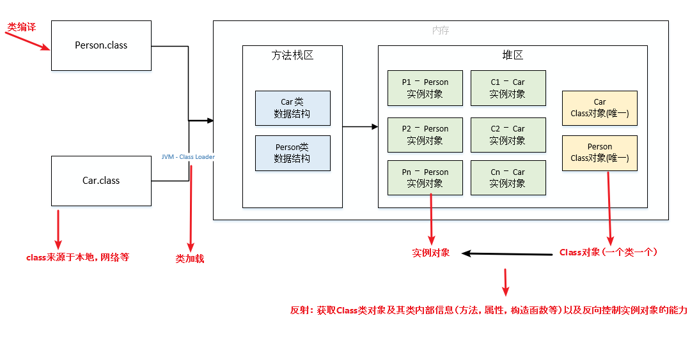

# Java 基础-反射机制详解
>JAVA反射机制是在运行状态中，对于任意一个类，都能够知道这个类的所有属性和方法；对于任意一个对象，都能够调用它的任意一个方法和属性；
>**这种动态获取的信息以及动态调用对象的方法的功能称为java语言的反射机制**。Java反射机制在框架设计中极为广泛，需要深入理解。本文综合多篇文章后，
>总结了Java 反射的相关知识，希望可以提升你对Java中反射的认知效率。

[[TOC]]

## 反射基础

RRIT（Run-Time Type Identification）运行时类型识别。在《Thinking in Java》一书第十四章中有提到，其作用是在运行时识别一个对象的类型和类的信息。
主要有两种方式：一种是“传统的”RTTI，它假定我们在编译时已经知道了所有的类型；另一种是“反射”机制，它允许我们在运行时发现和使用类的信息。

反射就是把java类中的各种成分映射成一个个的Java对象

例如：一个类有：成员变量、方法、构造方法、包等等信息，利用反射技术可以对一个类进行解剖，把个个组成部分映射成一个个对象。
>这里我们首先需要理解 Class类，以及类的加载机制； 然后基于此我们如何通过反射获取Class类以及类中的成员变量、方法、构造方法等。

### Class类
Class类，Class类也是一个实实在在的类，存在于JDK的java.lang包中。Class类的实例表示java应用运行时的类(class ans enum)或接口(interface and annotation)
（每个java类运行时都在JVM里表现为一个class对象，可通过类名.class、类型.getClass()、Class.forName("类名")等方法获取class对象）。
数组同样也被映射为为class 对象的一个类，所有具有相同元素类型和维数的数组都共享该 Class 对象。基本类型boolean，byte，char，short，int，long，float，double和关键字void同样表现为 class 对象。
``` java
public final class Class<T> implements java.io.Serializable,
                              GenericDeclaration,
                              Type,
                              AnnotatedElement {
    private static final int ANNOTATION= 0x00002000;
    private static final int ENUM      = 0x00004000;
    private static final int SYNTHETIC = 0x00001000;

    private static native void registerNatives();
    static {
        registerNatives();
    }

    /*
     * Private constructor. Only the Java Virtual Machine creates Class objects.   //私有构造器，只有JVM才能调用创建Class对象
     * This constructor is not used and prevents the default constructor being
     * generated.
     */
    private Class(ClassLoader loader) {
        // Initialize final field for classLoader.  The initialization value of non-null
        // prevents future JIT optimizations from assuming this final field is null.
        classLoader = loader;
    }
```

到这我们也就可以得出以下几点信息：
- Class类也是类的一种，与class关键字是不一样的。 
- 手动编写的类被编译后会产生一个Class对象，其表示的是创建的类的类型信息，而且这个Class对象保存在同名.class的文件中(字节码文件)
- 每个通过关键字class标识的类，在内存中有且只有一个与之对应的Class对象来描述其类型信息，无论创建多少个实例对象，其依据的都是用一个Class对象。 
- Class类只存私有构造函数，因此对应Class对象只能有JVM创建和加载 
- Class类的对象作用是运行时提供或获得某个对象的类型信息，这点对于反射技术很重要(关于反射稍后分析)。

### 类加载
类加载机制和类字节码技术可以参考如下两篇文章：
- [JVM基础 - 类字节码详解](../JVM/ByteCode.md)
- [JVM基础 - Java 类加载机制](../JVM/ClassLoader.md)

其中，这里我们需要回顾的是：
1. 类加载机制流程

2. 类的加载


## 反射的使用

::: tip
基于此我们如何通过反射获取Class类对象以及类中的成员变量、方法、构造方法等
:::

在Java中，Class类与java.lang.reflect类库一起对反射技术进行了全力的支持。在反射包中，我们常用的类主要有Constructor类表示的是Class 对象所表示的类的
构造方法，利用它可以在运行时动态创建对象、Field表示Class对象所表示的类的成员变量，通过它可以在运行时动态修改成员变量的属性值(包含private)、
Method表示Class对象所表示的类的成员方法，通过它可以动态调用对象的方法(包含private)，下面将对这几个重要类进行分别说明。

### Class类对象的获取

在类加载的时候，jvm会创建一个class对象

class对象是可以说是反射中最常用的，获取class对象的方式的主要有三种
- 根据类名：类名.class
- 根据对象：对象.getClass()
- 根据全限定类名：Class.forName(全限定类名)
``` java

    @Test
    public void classTest() throws Exception {
        // 获取Class对象的三种方式
        logger.info("根据类名:  \t" + User.class);
        logger.info("根据对象:  \t" + new User().getClass());
        logger.info("根据全限定类名:\t" + Class.forName("com.test.User"));
        // 常用的方法
        logger.info("获取全限定类名:\t" + userClass.getName());
        logger.info("获取类名:\t" + userClass.getSimpleName());
        logger.info("实例化:\t" + userClass.newInstance());
    }

    // ...
    package com.test;

    public class User {
        private String name = "init";
        private int age;
        public User() {}
        public User(String name, int age) {
            super();
            this.name = name;
            this.age = age;
        }
        private String getName() {
            return name;
        }
        private void setName(String name) {
            this.name = name;
        }
        public int getAge() {
            return age;
        }
        public void setAge(int age) {
            this.age = age;
        }
        @Override
        public String toString() {
            return "User [name=" + name + ", age=" + age + "]";
        }
    }
```
输出结果：
``` java
根据类名:  	class com.test.User
根据对象:  	class com.test.User
根据全限定类名:	class com.test.User
获取全限定类名:	com.test.User
获取类名:	com.test.User
实例化:	User [name=init, age=0]
```
- Class类的方法