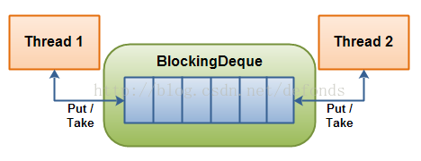

# JUC集合: BlockingQueue详解

>JUC里的 BlockingQueue 接口表示一个线程放入和提取实例的队列。

[[TOC]]

::: warning 带着问题理解
- BlockingQueue大家族有哪些? ArrayBlockingQueue, DelayQueue, LinkedBlockingQueue, SynchronousQueue...
- BlockingQueue适合用在什么样的场景?
- BlockingQueue常用的方法?
- BlockingQueue插入方法有哪些? 这些方法(add(o),offer(o),put(o),offer(o, timeout, timeunit))的区别是什么?
- 什么是BlockingDeque?
- BlockingDeque 与BlockingQueue有何关系，请对比下它们的方法?
- BlockingDeque适合用在什么样的场景?
- BlockingDeque大家族有哪些?
- BlockingDeque与BlockingQueue实现例子?
:::

## BlockingQueue和BlockingDeque

### BlockingQueue

BlockingQueue 通常用于一个线程生产对象，而另外一个线程消费这些对象的场景。

一个线程往里边放，另外一个线程从里边取的一个 BlockingQueue。

一个线程将会持续生产新对象并将其插入到队列之中，直到队列达到它所能容纳的临界点。也就是说，它是有限的。如果该阻塞队列到达了其临界点，
负责生产的线程将会在往里边插入新对象时发生阻塞。它会一直处于阻塞之中，直到负责消费的线程从队列中拿走一个对象。
负责消费的线程将会一直从该阻塞队列中拿出对象。如果消费线程尝试去从一个空的队列中提取对象的话，这个消费线程将会处于阻塞之中，直到一个生产线程把一个对象丢进队列。

### BlockingQueue 的方法

   |抛异常|特定值|阻塞|超时
---|:--:|---:|---:|---:
插入|add(o)|offer(o)|put(o)|offer(o, timeout, timeunit)
移除|remove(o)|poll(o)|take(o)|poll(timeout, timeunit)
检查|element(o)|peek(o)|  |

四组不同的行为方式解释: 
- 抛异常: 如果试图的操作无法立即执行，抛一个异常。 
- 特定值: 如果试图的操作无法立即执行，返回一个特定的值(常常是 true / false)。 
- 阻塞: 如果试图的操作无法立即执行，该方法调用将会发生阻塞，直到能够执行。 
- 超时: 如果试图的操作无法立即执行，该方法调用将会发生阻塞，直到能够执行，但等待时间不会超过给定值。
返回一个特定值以告知该操作是否成功(典型的是 true / false)。

无法向一个 BlockingQueue 中插入 null。如果你试图插入 null，BlockingQueue 将会抛出一个 NullPointerException。
可以访问到 BlockingQueue 中的所有元素，而不仅仅是开始和结束的元素。比如说，你将一个对象放入队列之中以等待处理，
但你的应用想要将其取消掉。那么你可以调用诸如 remove(o) 方法来将队列之中的特定对象进行移除。
但是这么干效率并不高(译者注: 基于队列的数据结构，获取除开始或结束位置的其他对象的效率不会太高)，
因此你尽量不要用这一类的方法，除非你确实不得不那么做。

### BlockingDeque

java.util.concurrent 包里的 BlockingDeque 接口表示一个线程放入和提取实例的双端队列。

BlockingDeque 类是一个双端队列，在不能够插入元素时，它将阻塞住试图插入元素的线程；在不能够抽取元素时，它将阻塞住试图抽取的线程。
deque(双端队列) 是 "Double Ended Queue" 的缩写。因此，双端队列是一个你可以从任意一端插入或者抽取元素的队列。

在线程既是一个队列的生产者又是这个队列的消费者的时候可以使用到 BlockingDeque。如果生产者线程需要在队列的两端都可以插入数据，
消费者线程需要在队列的两端都可以移除数据，这个时候也可以使用 BlockingDeque。BlockingDeque 图解:

