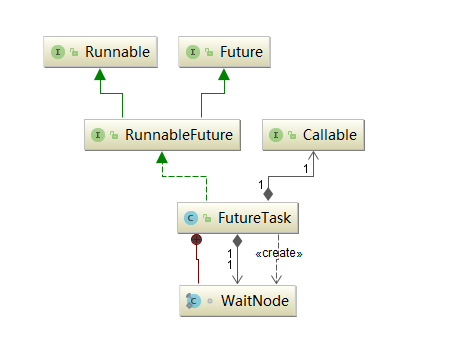

## JUC线程池: FutureTask详解

>Future 表示了一个任务的生命周期，是一个可取消的异步运算，可以把它看作是一个异步操作的结果的占位符，它将在未来的某个时刻完成，
>并提供对其结果的访问。在并发包中许多**异步任务类**都继承自Future，其中最典型的就是 FutureTask

[[TOC]]

::: warning 带着问题理解
- FutureTask用来解决什么问题的? 为什么会出现? 
- FutureTask类结构关系怎么样的? 
- FutureTask的线程安全是由什么保证的? 
- FutureTask结果返回机制? 
- FutureTask内部运行状态的转变? 
- FutureTask通常会怎么用? 举例说明。
:::

## FutureTask简介

FutureTask 为 Future 提供了基础实现，如获取任务执行结果(get)和取消任务(cancel)等。如果任务尚未完成，获取任务执行结果时将会阻塞。一旦执行结束，
任务就不能被重启或取消(除非使用runAndReset执行计算)。FutureTask 常用来封装 Callable 和 Runnable，也可以作为一个任务提交到线程池中执行。除了作为一个独立的类之外，
此类也提供了一些功能性函数供我们创建自定义 task 类使用。FutureTask 的线程安全由CAS来保证。

## FutureTask类关系



可以看到,FutureTask实现了RunnableFuture接口，则RunnableFuture接口继承了Runnable接口和Future接口，所以FutureTask既能当做一个Runnable直接被Thread执行，
也能作为Future用来得到Callable的计算结果。

::: tips  函数式接口 @FunctionalInterface

所谓函数式接口，当然首先是一个接口，然后就是在这个接口里面只能有一个抽象方法。

这种类型的接口也称为SAM接口，即Single Abstract Method interfaces

Runnable 和 Callable 都是函数式接口

特点：

- 接口有且仅有一个抽象方法
- 允许定义静态方法
- 允许定义默认方法
- 允许java.lang.Object中的public方法
- 该注解不是必须的，如果一个接口符合"函数式接口"定义，那么加不加该注解都没有影响。加上该注解能够更好地让编译器进行检查。如果编写的不是函数式接口，
但是加上了@FunctionInterface，那么编译器会报错

:::

## FutureTask源码解析

### Callable接口

Callable是个泛型接口，泛型V就是要call()方法返回的类型。对比Runnable接口，Runnable不会返回数据也不能抛出异常。

``` java
public interface Callable<V> {
    /**
     * Computes a result, or throws an exception if unable to do so.
     *
     * @return computed result
     * @throws Exception if unable to compute a result
     */
    V call() throws Exception;
}
```
