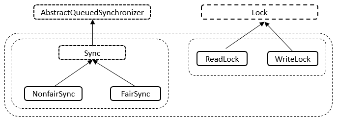

# JUC锁: ReentrantReadWriteLock详解

>ReentrantReadWriteLock表示可重入读写锁，ReentrantReadWriteLock中包含了两种锁，读锁ReadLock和写锁WriteLock，可以通过这两种锁实现线程间的同步。

[[TOC]]

::: warning
- 为什么有了ReentrantLock还需要ReentrantReadWriteLock? 
- ReentrantReadWriteLock底层实现原理? 
- ReentrantReadWriteLock底层读写状态如何设计的? 高16位为读锁，低16位为写锁 
- 读锁和写锁的最大数量是多少? 
- 本地线程计数器ThreadLocalHoldCounter是用来做什么的? 
- 缓存计数器HoldCounter是用来做什么的? 
- 写锁的获取与释放是怎么实现的? 
- 读锁的获取与释放是怎么实现的? 
- 什么是锁的升降级? ReentrantReadWriteLock为什么不支持锁升级? 
:::

## 什么是读写锁

什么是读写锁

**读写锁**，并不是 Java 语言特有的，而是一个广为使用的通用技术，所有的读写锁都遵守以下三条基本原则：

- 允许多个线程同时读共享变量；
- 只允许一个线程写共享变量；
- 如果一个写线程正在执行写操作，此时禁止读线程读共享变量。

在Java并发包中常用的锁（如：ReentrantLock），基本上都是排他锁(也叫互斥锁?也叫写锁?)，这些锁在同一时刻只允许一个线程进行访问

读写锁与互斥锁的一个重要区别就是**读写锁允许多个线程同时读共享变量**，而互斥锁是不允许的，
这是读写锁在读多写少场景下性能优于互斥锁的关键。

但**读写锁的写操作是互斥**的，当一个线程在写共享变量的时候，是不允许其他线程执行读操作和写操作的。

## ReentrantReadWriteLock数据结构

ReentrantReadWriteLock底层是基于ReentrantLock和AbstractQueuedSynchronizer来实现的，所以，ReentrantReadWriteLock的数据结构也依托于AQS的数据结构。

## ReentrantReadWriteLock源码分析
   
### 类的继承关系

``` java
public class ReentrantReadWriteLock implements ReadWriteLock, java.io.Serializable {}
```

说明: 可以看到，ReentrantReadWriteLock实现了ReadWriteLock接口，ReadWriteLock接口定义了获取读锁和写锁的规范，具体需要实现类去实现；
同时其还实现了Serializable接口，表示可以进行序列化，在源代码中可以看到ReentrantReadWriteLock实现了自己的序列化逻辑。

### 类的内部类

ReentrantReadWriteLock有五个内部类，五个内部类之间也是相互关联的。内部类的关系如下图所示。



说明: 如上图所示，Sync继承自AQS、NonfairSync继承自Sync类、FairSync继承自Sync类；ReadLock实现了Lock接口、WriteLock也实现了Lock接口。

内部类 - Sync类

- 类的继承关系

``` java
abstract static class Sync extends AbstractQueuedSynchronizer {}
```
说明: Sync抽象类继承自AQS抽象类，Sync类提供了对ReentrantReadWriteLock的支持。

- 类的内部类

Sync类内部存在两个内部类，分别为HoldCounter和ThreadLocalHoldCounter，其中HoldCounter主要与读锁配套使用，其中，HoldCounter源码如下。

``` java
// 计数器
static final class HoldCounter {
    // 计数
    int count = 0;
    // Use id, not reference, to avoid garbage retention
    // 获取当前线程的TID属性的值
    final long tid = getThreadId(Thread.currentThread());
}
```
说明: HoldCounter主要有两个属性，count和tid，其中count表示某个读线程重入的次数，tid表示该线程的tid字段的值，
该字段可以用来唯一标识一个线程。ThreadLocalHoldCounter的源码如下

``` java
// 本地线程计数器
static final class ThreadLocalHoldCounter
    extends ThreadLocal<HoldCounter> {
    // 重写初始化方法，在没有进行set的情况下，获取的都是该HoldCounter值
    public HoldCounter initialValue() {
        return new HoldCounter();
    }
}
```
说明: ThreadLocalHoldCounter重写了ThreadLocal的initialValue方法，ThreadLocal类可以将线程与对象相关联。在没有进行set的情况下，
get到的均是initialValue方法里面生成的那个HolderCounter对象。