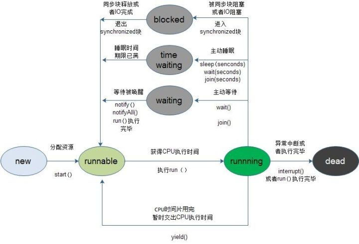

# Java并发 - 线程基础

> 本文主要概要性的介绍线程的基础，为后面的章节深入介绍Java并发的知识提供基础


[[TOC]]

## 带着问题理解
::: warning
- 线程有哪几种状态？
- 分别说明从一种状态到另一种状态转变有哪些方式？ 
- 通常线程有哪几种使用方式？ 
- 基础线程机制有哪些？ 
- 线程的中断方式有哪些？ 
- 线程的互斥同步方式有哪些？如何比较和选择？ 
- 线程之间有哪些协作方式？
:::
## 线程状态转换

1、**新建状态（New）**：新创建了一个线程对象。

2、**就绪状态（Runnable）**：线程对象创建后，其他线程调用了该对象的start()方法。该状态的线程位于可运行线程池中，变得可运行，等待获取CPU的使用权。

3、**运行状态（Running）**：就绪状态的线程获取了CPU，执行程序代码。

4、**阻塞状态（Blocked）：阻塞状态是线程因为某种原因放弃CPU使用权，暂时停止运行。直到线程进入就绪状态，才有机会转到运行状态。阻塞的情况分三种：**

**（一）、等待阻塞：运行的线程执行wait()方法，JVM会把该线程放入等待池中。(wait会释放持有的锁)**

**（二）、同步阻塞：运行的线程在获取对象的同步锁时，若该同步锁被别的线程占用，则JVM会把该线程放入锁池中。**

**（三）、其他阻塞：运行的线程执行sleep()或join()方法，或者发出了I/O请求时，JVM会把该线程置为阻塞状态。当sleep()状态超时、join()等待线程终止或者超时、
或者I/O处理完毕时，线程重新转入就绪状态。（注意,sleep是不会释放持有的锁）**

5、**死亡状态（Dead）**：线程执行完了或者因异常退出了run()方法，该线程结束生命周期。



### 新建(New)

新创建了一个线程对象，尚未启动

### 可运行(Runnable)

线程对象创建后，其他线程调用了该对象的start()方法。该状态的线程位于可运行线程池中，变得可运行，等待获取CPU的使用权。

包含了操作系统线程状态中的Running和Ready

就绪状态的线程获取了CPU，执行程序代码。

### 阻塞(Blocking)

等待获取一个排它锁，如果其线程释放了锁就会结束此状态。

### 无限期等待(Waiting)

等待其它线程显式地唤醒，否则不会被分配 CPU 时间片。

进入方法|退出方法|
--|:--:|
没有设置 Timeout 参数的 Object.wait() 方法|Object.notify() / Object.notifyAll()|
没有设置 Timeout 参数的 Thread.join() 方法|被调用的线程执行完毕|
LockSupport.park() 方法|-|

### 限期等待(Timed Waiting)

无需等待其它线程显式地唤醒，在一定时间之后会被系统自动唤醒。

调用 Thread.sleep() 方法使线程进入限期等待状态时，常常用“使一个线程睡眠”进行描述

调用 Object.wait() 方法使线程进入限期等待或者无限期等待时，常常用“挂起一个线程”进行描述。

睡眠和挂起是用来描述行为，而阻塞和等待用来描述状态。

阻塞和等待的区别在于，阻塞是被动的，它是在等待获取一个排它锁。而等待是主动的，通过调用 Thread.sleep() 和 Object.wait() 等方法进入。

进入方法|退出方法|
--|:--:|
Thread.sleep() 方法|时间结束|
设置了 Timeout 参数的 Object.wait() 方法|时间结束 / Object.notify() / Object.notifyAll()|
设置了 Timeout 参数的 Thread.join() 方法|时间结束 / 被调用的线程执行完毕|
LockSupport.parkNanos() 方法|-|
LockSupport.parkUntil() 方法|-|

### 死亡(Terminated)

可以是线程结束任务之后自己结束，或者产生了异常而结束。

---

## 线程使用方式

有三种使用线程的方法: 

- 实现 Runnable 接口； 

- 实现 Callable 接口； 

- 继承 Thread 类。 

- 线程池调用

实现 Runnable 和 Callable 接口的类只能当做一个可以在线程中运行的任务，不是真正意义上的线程，

因此最后还需要通过 Thread 来调用。可以说任务是通过线程驱动从而执行的。

### 实现Runnable接口

需要实现 run() 方法。

通过 Thread 调用 start() 方法来启动线程。

``` java
public class MyRunnable implements Runnable {
   public void run() {
    // ...
   }
}
```
``` java
public static void main(String[] args) {
   MyRunnable instance = new MyRunnable();
   Thread thread = new Thread(instance);
   thread.start();
}
```
### 继承Thread类

 同样也是需要实现 run() 方法，因为 Thread 类也实现了 Runable 接口。 
 
 当调用 start() 方法启动一个线程时，虚拟机会将该线程放入就绪队列中等待被调度，当一个线程被调度时会执行该线程的 run() 方法。

``` java
public class MyThread extends Thread {
    public void run() {
        // ...
    }
}
```
``` java
public static void main(String[] args) {
    MyThread mt = new MyThread();
    mt.start();
}
```

### 实现Callable接口(#a)

与 Runnable 相比，Callable 可以有**返回值**，返回值通过 FutureTask 进行封装。

``` java
public class MyCallable implements Callable<Integer> {
    public Integer call() {
        return 123;
    }
}
```
``` java
public static void main(String[] args) throws ExecutionException, InterruptedException {
    MyCallable mc = new MyCallable();
    FutureTask<Integer> ft = new FutureTask<>(mc);
    Thread thread = new Thread(ft);
    thread.start();
    System.out.println(ft.get());
}
```

### 实现接口 VS 继承Thread类 ?

实现接口会更好一些，因为:

Java 不支持多重继承，因此继承了 Thread 类就无法继承其它类，但是可以实现多个接口；

类可能只要求可执行就行，继承整个 Thread 类开销过大。

实现Runnable接口比继承Thread类所具有的优势：

1）：适合多个相同的程序代码的线程去处理同一个资源

2）：可以避免java中的单继承的限制

3）：增加程序的健壮性，代码可以被多个线程共享，代码和数据独立

4）：线程池只能放入实现Runable或callable类线程，不能直接放入继承Thread的类

## 基础线程机制

### Executor(线程池)

Executor 管理多个异步任务的执行，而无需程序员显式地管理线程的生命周期。
这里的异步是指多个任务的执行互不干扰，不需要进行同步操作。

[AAA](ExecutorPool.md)

### Daemon

守护线程是程序运行时在后台提供服务的线程，不属于程序中不可或缺的部分。

当所有非守护线程结束时，程序也就终止，同时会杀死所有守护线程。

main() 属于非守护线程。

使用 setDaemon() 方法将一个线程设置为守护线程。

后台线程（守护线程）：在后台运行的线程，其目的是为其他线程提供服务，也称为“守护线程”。

①、JVM 的垃圾回收线程就是守护线程。

②、main 方法是前台线程，不是后台线程

特点：

①、若所有的前台线程都死亡，则后台线程自动死亡；

②、前台线程没有结束，后台线程是不会结束的；

③、前台线程创建的线程是前台线程，后台线程创建的线程是后台线程。

　　Thread.setDaemon(Boolean on)必须在 start() 的方法前调用。否则会报错。

``` java
public static void main(String[] args) {
    Thread thread = new Thread(new MyRunnable());
    thread.setDaemon(true);
}
```

### sleep()
Thread.sleep(millisec) 方法会休眠当前正在执行的线程，millisec 单位为毫秒。 

sleep() 可能会抛出 InterruptedException，因为异常不能跨线程传播回 main() 中，
因此必须在本地进行处理。线程中抛出的其它异常也同样需要在本地进行处理。

``` java
public void run() {
    try {
        Thread.sleep(3000);
    } catch (InterruptedException e) {
        e.printStackTrace();
    }
}
```
### yield()

暂停当前正在执行的线程对象，把执行机会让给**相同或者更高优先级的线程**。

对静态方法 Thread.yield() 的调用声明了当前线程已经完成了生命周期中最重要的部分，可以切换给其它线程来执行。
该方法只是对线程调度器的一个建议，而且也只是**建议具有相同优先级的其它线程可以运行**。

sleep() 和 yield() 方法的区别：

　　①、都能使当前处于运行状态的线程放弃 CPU资源，把运行的机会给其他线程

　　②、sleep 方法会给其他线程运行的机会，但是不考虑其他线程优先级的问题；yield 方法会优先给更高优先级的线程运行机会

　　③、调用 sleep 方法后，线程进入计时等待状态，调用 yield 方法后，线程进入就绪状态。

``` java
public void run() {
    Thread.yield();
}
```

## 线程中断

一个线程执行完毕之后会自动结束，如果在运行过程中发生异常也会提前结束。

### InterruptedException

如何中断一个线程？

**通过调用一个线程的 interrupt() 来中断该线程，**

条件是什么？

如果该线程处于**阻塞**、**限期等待**或者**无限期等待**状态，那么就会抛出 InterruptedException，从而提前结束该线程。

::: danger
但是不能中断 I/O 阻塞和 synchronized 锁阻塞。
:::

对于以下代码，在 main() 中启动一个线程之后再中断它，由于线程中调用了 Thread.sleep() 方法，
因此会抛出一个 InterruptedException，从而提前结束线程，不执行之后的语句。

``` java
public class InterruptExample {

    private static class MyThread1 extends Thread {
        @Override
        public void run() {
            try {
                Thread.sleep(2000);
                System.out.println("Thread run");
            } catch (InterruptedException e) {
                e.printStackTrace();
            }
        }
    }
}
```
``` java
public static void main(String[] args) throws InterruptedException {
    Thread thread1 = new MyThread1();
    thread1.start();
    thread1.interrupt();
    System.out.println("Main run");
}
```

### interrupted()

如果一个线程的 run() 方法执行一个无限循环，并且没有执行 sleep() 等会抛出 InterruptedException 的操作，那么调用线程的 interrupt() 方法就无法使线程提前结束。

但是调用 interrupt() 方法会设置线程的**中断标记**，此时调用 interrupted() 方法会返回 true。因此可以在循环体中
<U>使用 interrupted() 方法来判断线程是否处于中断状态，从而提前结束线程。</u>

``` java
public class InterruptExample {

    private static class MyThread2 extends Thread {
        @Override
        public void run() {
            while (!interrupted()) {
                // ..
            }
            System.out.println("Thread end");
        }
    }
}
```
``` java
public static void main(String[] args) throws InterruptedException {
    Thread thread2 = new MyThread2();
    thread2.start();
    thread2.interrupt();
}
```
``` java
Thread end   //interrupted()方法判断此线程没有被中断 所以执行了之后的方法
```

## Executor 线程池的中断操作

调用 Executor 的 **shutdown()** 方法会等待线程都执行完毕之后再关闭，

但是如果调用的是 **shutdownNow()** 方法，则相当于调用每个线程的 interrupt() 方法。 

以下使用 Lambda 创建线程，相当于创建了一个匿名内部线程。

``` java
public static void main(String[] args) {
   ExecutorService executorService = Executors.newCachedThreadPool();
   executorService.execute(() -> {
       try {
           Thread.sleep(2000);
           System.out.println("Thread run");
       } catch (InterruptedException e) {
           e.printStackTrace();
       }
   });
   executorService.shutdownNow();
   System.out.println("Main run");
}
```
``` java
Main run
java.lang.InterruptedException: sleep interrupted
    at java.lang.Thread.sleep(Native Method)
    at ExecutorInterruptExample.lambda$main$0(ExecutorInterruptExample.java:9)
    at ExecutorInterruptExample$$Lambda$1/1160460865.run(Unknown Source)
    at java.util.concurrent.ThreadPoolExecutor.runWorker(ThreadPoolExecutor.java:1142)
    at java.util.concurrent.ThreadPoolExecutor$Worker.run(ThreadPoolExecutor.java:617)
    at java.lang.Thread.run(Thread.java:745)
```

如果只想中断 Executor 中的一个线程，可以通过使用 submit() 方法来提交一个线程，它会返回一个 Future<?> 对象，通过调用该对象的 cancel(true) 方法就可以中断线程。

``` java
Future<?> future = executorService.submit(() -> {
    // ..
});
future.cancel(true);
```

## 线程互斥同步

Java 提供了两种锁机制来控制多个线程对共享资源的互斥访问，

- 第一个是 JVM 实现的 synchronized，

- 而另一个是 JDK 实现的 ReentrantLock。

### synchronized

1. 同步一个代码块

``` java
public void func() {
    synchronized (this) {
        // ...
    }
}
```
它只作用于同一个对象，如果调用两个对象上的同步代码块，就不会进行同步。

对于以下代码，使用 ExecutorService 执行了两个线程，由于调用的是同一个对象的同步代码块，因此这两个线程会进行同步，当一个线程进入同步语句块时，另一个线程就必须等待。

2. 同步一个方法

3. 同步一个类

### ReentrantLock

ReentrantLock 是 java.util.concurrent(J.U.C)包中的锁。

``` java
public class LockExample {

    private Lock lock = new ReentrantLock();

    public void func() {
        lock.lock();
        try {
            for (int i = 0; i < 10; i++) {
                System.out.print(i + " ");
            }
        } finally {
            lock.unlock(); // 确保释放锁，从而避免发生死锁。
        }
    }
}
```
``` java
public static void main(String[] args) {
    LockExample lockExample = new LockExample();
    ExecutorService executorService = Executors.newCachedThreadPool();
    executorService.execute(() -> lockExample.func());
    executorService.execute(() -> lockExample.func());
}
```
``` java
0 1 2 3 4 5 6 7 8 9 0 1 2 3 4 5 6 7 8 9
```
#### 比较

1.锁的实现

synchronized 是 JVM 实现的，而 ReentrantLock 是 JDK 实现的。

2.性能

新版本 Java 对 synchronized 进行了很多优化，例如自旋锁等，synchronized 与 ReentrantLock 大致相同。

3.等待可中断

当持有锁的线程长期不释放锁的时候，正在等待的线程可以选择放弃等待，改为处理其他事情。

ReentrantLock 可中断，而 synchronized 不行。

4.公平锁

公平锁是指多个线程在等待同一个锁时，必须按照申请锁的时间顺序来依次获得锁。

synchronized 中的锁是非公平的，ReentrantLock 默认情况下也是非公平的，但是也可以是公平的。

5.锁绑定多个条件

一个 ReentrantLock 可以同时绑定多个 Condition 对象。

### 使用选择

除非需要使用 ReentrantLock 的高级功能，否则优先使用 synchronized。

这是因为 synchronized 是 JVM 实现的一种锁机制，JVM 原生地支持它，而 ReentrantLock 不是所有的 JDK 版本都支持。并且使用 synchronized 不用担心没有释放锁而导致死锁问题，因为 JVM 会确保锁的释放。

### 线程之间的协作

当多个线程可以一起工作去解决某个问题时，如果某些部分必须在其它部分之前完成，那么就需要对线程进行协调。

#### join()

等待其他线程终止。在当前线程中调用另一个线程的join()方法，则当前线程转入阻塞状态，直到另一个进程运行结束，当前线程再由阻塞转为就绪状态。

在线程中调用另一个线程的 join() 方法，会将当前线程挂起，而不是忙等待，直到目标线程结束。

对于以下代码，虽然 b 线程先启动，但是因为在 b 线程中调用了 a 线程的 join() 方法，b 线程会等待 a 线程结束才继续执行，
因此最后能够保证 a 线程的输出先于 b 线程的输出。

``` java
public class JoinExample {

    private class A extends Thread {
        @Override
        public void run() {
            System.out.println("A");
        }
    }

    private class B extends Thread {

        private A a;

        B(A a) {
            this.a = a;
        }

        @Override
        public void run() {
            try {
                a.join();
            } catch (InterruptedException e) {
                e.printStackTrace();
            }
            System.out.println("B");
        }
    }

    public void test() {
        A a = new A();
        B b = new B(a);
        b.start();
        a.start();
    }
}
```
``` java
public static void main(String[] args) {
    JoinExample example = new JoinExample();
    example.test();
}
```
``` java
A
B
```


``` java
package com.ys.thread;
 
class Join extends Thread{
    @Override
    public void run() {
        for(int i = 0 ; i < 10 ;i++){
            System.out.println("播放音乐"+i);
        }
    }
}
 
public class ThreadTest {
    public static void main(String[] args) {
        //创建 join 线程对象
        Join joinThread = new Join();
        for(int i = 0 ; i < 10 ; i++){
            System.out.println("玩游戏"+i);
            if(i==3){
                joinThread.start();
            }
            if(i==5){
                try {
                    joinThread.join();//强制运行 join 线程，知道 join 运行完毕了，main 才有机会运行
                } catch (InterruptedException e) {
                    e.printStackTrace();
                }
            }
        }
    }
 
}
```
结果
``` java
玩游戏0
玩游戏1
玩游戏2
玩游戏3
玩游戏4
玩游戏5
播放音乐0
播放音乐1
播放音乐2
播放音乐3
播放音乐4
播放音乐5
播放音乐6
播放音乐7
播放音乐8
播放音乐9
玩游戏6
玩游戏7
玩游戏8
玩游戏9
```

#### wait() notify() notifyAll()
**这里我们介绍一个同步锁池的概念：**

　　**同步锁池：同步锁必须选择多个线程共同的资源对象，而一个线程获得锁的时候，别的线程都在同步锁池等待获取锁；
当那个线程释放同步锁了，其他线程便开始由CPU调度分配锁**

**wait():执行该方法的线程对象，释放同步锁，JVM会把该线程放到等待池中，等待其他线程唤醒该线程**

**notify():执行该方法的线程唤醒在等待池中等待的任意一个线程，把线程转到锁池中等待（注意锁池和等待池的区别）**

**notifyAll():执行该方法的线程唤醒在等待池中等待的所有线程，把线程转到锁池中等待。**
::: danger
注意：上述方法只能被同步监听锁对象来调用，这也是为啥wait() 和 notify()方法都在 Object 对象中，因为同步监听锁可以是任意对象，
只不过必须是需要同步线程的共同对象即可，否则别的对象调用会报错：java.lang.IllegalMonitorStateException
:::
::: warning
假设 A 线程和 B 线程同时操作一个 X 对象，A，B 线程可以通过 X 对象的 wait() 和 notify() 方法来进行通信，流程如下：

①、当线程 A 执行 X 对象的同步方法时，A 线程持有 X 对象的 锁，B线程在 X 对象的锁池中等待

②、A线程在同步方法中执行 X.wait() 方法时，A线程释放 X 对象的锁，进入 X 对象的等待池中

③、在 X 对象的锁池中等待锁的 B 线程获得 X 对象的锁，执行 X 的另一个同步方法

④、B 线程在同步方法中执行 X.notify() 方法，JVM 把 A 线程从等待池中移动到 X 对象的锁池中，等待获取锁

⑤、B 线程执行完同步方法，释放锁，等待获取锁的 A 线程获得锁，继续执行同步方法
:::
调用 wait() 使得线程等待某个条件满足，线程在等待时会被挂起，当其他线程的运行使得这个条件满足时，其它线程会调用 notify() 或者 notifyAll() 来唤醒挂起的线程。 

它们都属于 Object 的一部分，而不属于 Thread。 

只能用在同步方法或者同步控制块中使用，否则会在运行时抛出 IllegalMonitorStateExeception。
 
使用 wait() 挂起期间，线程会释放锁。这是因为，如果没有释放锁，那么其它线程就无法进入对象的同步方法或者同步控制块中，那么就无法执行 notify() 或者 notifyAll() 来唤醒挂起的线程，造成死锁。

``` java
public class WaitNotifyExample {
    public synchronized void before() {
        System.out.println("before");
        notifyAll();
    }

    public synchronized void after() {
        try {
            wait();
        } catch (InterruptedException e) {
            e.printStackTrace();
        }
        System.out.println("after");
    }
}
```
``` java
public static void main(String[] args) {
    ExecutorService executorService = Executors.newCachedThreadPool();
    WaitNotifyExample example = new WaitNotifyExample();
    executorService.execute(() -> example.after());
    executorService.execute(() -> example.before());
}
```
``` java
before
after
```


##### wait() 和 sleep() 的区别

- wait() 是 Object 的方法，而 sleep() 是 Thread 的静态方法；
  
- wait() 会释放锁，sleep() 不会。

- sleep使用interrupt()来唤醒,wait需要notify或者notifyAll来通知

共同点： 
1. 他们都是在多线程的环境下，都可以在程序的调用处阻塞指定的毫秒数，并返回。 
2. wait()和sleep()都可以通过interrupt()方法 打断线程的暂停状态 ，从而使线程立刻抛出InterruptedException。 
   如果线程A希望立即结束线程B，则可以对线程B对应的Thread实例调用interrupt方法。如果此刻线程B正在wait/sleep /join，
   则线程B会立刻抛出InterruptedException，在catch() {} 中直接return即可安全地结束线程。 
   需要注意的是，InterruptedException是线程自己从内部抛出的，并不是interrupt()方法抛出的。对某一线程调用 interrupt()时，如果该线程正在执行普通的代码，
   那么该线程根本就不会抛出InterruptedException。但是，一旦该线程进入到 wait()/sleep()/join()后，就会立刻抛出InterruptedException。
   
不同点： 
1. Thread类的方法：sleep(),yield()等 
   Object的方法：wait()和notify()等 
2. 每个对象都有一个锁来控制同步访问。Synchronized关键字可以和对象的锁交互，来实现线程的同步。 
   sleep方法没有释放锁，而wait方法释放了锁，使得其他线程可以使用同步控制块或者方法。 
3. wait，notify和notifyAll只能在同步控制方法或者同步控制块里面使用，而sleep可以在任何地方使用 
4. sleep必须捕获异常，而wait，notify和notifyAll不需要捕获异常
所以sleep()和wait()方法的最大区别是：
　　　　sleep()睡眠时，保持对象锁，仍然占有该锁；
　　　　而wait()睡眠时，释放对象锁。
　　但是wait()和sleep()都可以通过interrupt()方法打断线程的暂停状态，从而使线程立刻抛出InterruptedException（但不建议使用该方法）。
sleep（）方法
sleep()使当前线程进入停滞状态（阻塞当前线程），让出CUP的使用、目的是不让当前线程独自霸占该进程所获的CPU资源，以留一定时间给其他线程执行的机会;
　　 sleep()是Thread类的Static(静态)的方法；因此他不能改变对象的机锁，所以当在一个Synchronized块中调用Sleep()方法是，线程虽然休眠了，
但是对象的机锁并木有被释放，其他线程无法访问这个对象（即使睡着也持有对象锁）。
　　**在sleep()休眠时间期满后，该线程不一定会立即执行，这是因为其它线程可能正在运行而且没有被调度为放弃执行，除非此线程具有更高的优先级。**
wait（）方法
wait()方法是Object类里的方法；当一个线程执行到wait()方法时，它就进入到一个和该对象相关的等待池中，同时失去（释放）了对象的机锁
（暂时失去机锁，wait(long timeout)超时时间到后还需要返还对象锁）；其他线程可以访问；
　　wait()使用notify或者notifyAlll或者指定睡眠时间来唤醒当前等待池中的线程。
　　wiat()必须放在synchronized block中，否则会在program runtime时扔出”java.lang.IllegalMonitorStateException“异常。

#### await() signal() signalAll()

java.util.concurrent 类库中提供了 Condition 类来实现线程之间的协调，可以在 Condition 上调用 await() 方法使线程等待，
其它线程调用 signal() 或 signalAll() 方法唤醒等待的线程。相比于 wait() 这种等待方式，await() 可以指定等待的条件，因此更加灵活

使用 Lock 来获取一个 Condition 对象。

``` java
public class AwaitSignalExample {
    private Lock lock = new ReentrantLock();
    private Condition condition = lock.newCondition();

    public void before() {
        lock.lock();
        try {
            System.out.println("before");
            condition.signalAll();
        } finally {
            lock.unlock();
        }
    }

    public void after() {
        lock.lock();
        try {
            condition.await();
            System.out.println("after");
        } catch (InterruptedException e) {
            e.printStackTrace();
        } finally {
            lock.unlock();
        }
    }
}
```
``` java
public static void main(String[] args) {
    ExecutorService executorService = Executors.newCachedThreadPool();
    AwaitSignalExample example = new AwaitSignalExample();
    executorService.execute(() -> example.after());
    executorService.execute(() -> example.before());
}
```
``` java
before
after
```

 ## 常见线程名词解释
 
 主线程：JVM调用程序main()所产生的线程。
 
 当前线程：这个是容易混淆的概念。一般指通过Thread.currentThread()来获取的进程。
 
 后台线程：指为其他线程提供服务的线程，也称为守护线程。JVM的垃圾回收线程就是一个后台线程。用户线程和守护线程的区别在于，是否等待主线程依赖于主线程结束而结束
 
 前台线程：是指接受后台线程服务的线程，其实前台后台线程是联系在一起，就像傀儡和幕后操纵者一样的关系。傀儡是前台线程、幕后操纵者是后台线程。
 由前台线程创建的线程默认也是前台线程。可以通过isDaemon()和setDaemon()方法来判断和设置一个线程是否为后台线程。
 
线程类的一些常用方法：  

**sleep()**: 强迫一个线程睡眠Ｎ毫秒。 

**isAlive()**: 判断一个线程是否存活。 

**join()**: 等待线程终止。 

**activeCount()**: 程序中活跃的线程数。 

**enumerate()**: 枚举程序中的线程。 

**currentThread()**: 得到当前线程。 

**isDaemon()**: 一个线程是否为守护线程。 

**setDaemon()**: 设置一个线程为守护线程。(用户线程和守护线程的区别在于，是否等待主线程依赖于主线程结束而结束) 

**setName()**: 为线程设置一个名称。 

**wait()**: 强迫一个线程等待。 

**notify()**: 通知一个线程继续运行。 

**setPriority()**: 设置一个线程的优先级。

## 死锁:
   
   ①、多线程通信的时候，很容易造成死锁，死锁无法解决，只能避免
   
   ②、当 A 线程等待由 B 线程持有的锁，而 B 线程正在等待由 A 线程持有的锁时发生死锁现象（比如A拿着铅笔，B拿着圆珠笔，
   A说你先给我圆珠笔，我就把铅笔给你，而B说你先给我铅笔，我就把圆珠笔给你，这就造成了死锁，A和B永远不能进行交换）
   
   ③、JVM 既不检测也不避免这种现象，所以程序员必须保证不能出现这样的情况
   
    
   
   Thread 类中容易造成死锁的方法（这两个方法都已经过时了，不建议使用）：
   
   suspend():使正在运行的线程放弃 CPU，暂停运行（不释放锁）
   
   resume():使暂停的线程恢复运行
   
   情景：A 线程获得对象锁，正在执行一个同步方法，如果 B线程调用 A 线程的 suspend() 方法，此时A 暂停运行，放弃 CPU 资源，但是不放弃同步锁，那么B也不能获得锁，A又暂停，那么便造成死锁。
   
    
   
**解决死锁法则：当多个线程需要访问 共同的资源A,B，C时，必须保证每一个线程按照一定的顺序去访问，比如都先访问A，然后B，最后C。
就像我们这里的生产者---消费者模型，制定了必须生产者先生产一个对象，然后消费者去消费，消费完毕，生产者才能在开始生产，
然后消费者在消费。这样的顺序便不会造成死锁。**