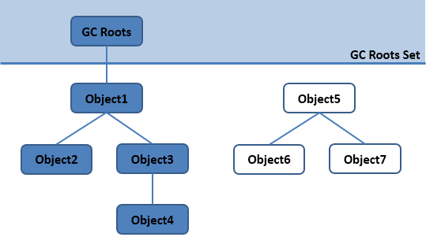

# 垃圾收集

[[TOC]]

## 垃圾收集机制

 
 
 1.对象在新生代 Eden 区分配，当 Eden 区空间不够时，发起 Minor GC
 
 2.经历一次minorGC 时垃圾对象的在Eden区直接清除，非垃圾对象复制(复制算法)到Survivor 中，**对象头**中的分代年龄+1(可设置)

 3.当Eden区再次被占满，再经历一次minorGC 此时垃圾对象直接清除，而把Eden区和Survivor区中未被回收的对象复制到ToSurvivor区，并且再上一次的分代年龄基础上再+1
 
 4.再一次的经历minorGC，则会把ToSurvivor区和Eden区的非垃圾对象复制到Survivor区，存活的对象分代年龄再次+1，这些存活对象在
 Survivor区和ToSurvivor区来回流转，当分代年龄加到15时，这些对象直接被放入到老年代当中
 
 5.当老年代被占满之后不会先抛出OOM(内存溢出)出而是会执行一次**Full GC**，Full GC会尝试收集整个堆内存当中的对象
 
 6.注意:如果有一批对象的总大小大于Survivor区内存大小的50%，则这些对象直接被分配到老年代(**对象动态年龄判断**)
 jvisualvm
 
 STW(stop the world):每一次的full gc 会伴随STW的发生 也就是会暂停用户线程进行垃圾回收
 
 <u>java虚拟机调优的目的</u>: 避免full gc  减少full gc的执行时间
 
 
 
 **面试题：能否对jvm调优,让其几乎不发生Full GC?**
 
 通过对象动态年龄的判断机制 可以让对象的生成和消除在Survivor区和ToSurvivor区之间来回流转
 
## 可达性分析算法

GC Roots 根

Java 虚拟机使用该算法来判断对象是否可被回收，在 Java 中 GC Roots 一般包含以下内容: 

- 虚拟机栈中引用的对象 

- 本地方法栈中引用的对象 

- 方法区中类静态属性引用的对象 

- 方法区中的常量引用的对象

 

> 以GC Roots对象最为起点，从这些节点开始向下搜索引用的对象，找到的对象都标记为非垃圾对象，其余未标记的对象都是垃圾对象

## 内存分配与回收策略

### Minor GC 和 Full GC

- Minor GC: 发生在新生代上，因为新生代对象存活时间很短，因此 Minor GC 会频繁执行，执行的速度一般也会比较快。
 
- Full GC: 发生在老年代上，老年代对象其存活时间长，因此 Full GC 很少执行，执行速度会比 Minor GC 慢很多。

### 内存分配策略

1.对象优先在 Eden 分配

大多数情况下，对象在新生代 Eden 区分配，当 Eden 区空间不够时，发起 Minor GC。

2. 大对象直接进入老年代

大对象是指需要连续内存空间的对象，最典型的大对象是那种**很长的字符串**以及**数组**。 

经常出现大对象会提前触发垃圾收集以获取足够的连续空间分配给大对象。
 
 -XX:PretenureSizeThreshold，大于此值的对象直接在老年代分配，避免在 Eden 区和 Survivor 区之间的大量内存复制。
 
3. 长期存活的对象进入老年代

为对象定义年龄计数器，对象在 Eden 出生并经过 Minor GC 依然存活，将移动到 Survivor 中，年龄就增加 1 岁，增加到一定年龄则移动到老年代中。
 
 -XX:MaxTenuringThreshold 用来定义年龄的阈值。
 
4. 动态对象年龄判定

虚拟机并不是永远地要求对象的年龄必须达到 MaxTenuringThreshold 才能晋升老年代，如果在 Survivor 中相同年龄所有对象大小的总和大于 Survivor 空间的一半，
则年龄大于或等于该年龄的对象可以直接进入老年代，无需等到 MaxTenuringThreshold 中要求的年龄。

5. 空间分配担保

在发生 Minor GC 之前，虚拟机先检查老年代最大可用的连续空间是否大于新生代所有对象总空间，如果条件成立的话，那么 Minor GC 可以确认是安全的。 

如果不成立的话虚拟机会查看 HandlePromotionFailure 设置值是否允许担保失败，如果允许那么就会继续检查老年代最大可用的连续空间是否大于历次晋升到老年代对象的平均大小，
如果大于，将尝试着进行一次 Minor GC；如果小于，或者 HandlePromotionFailure 设置不允许冒险，那么就要进行一次 Full GC。

### Full GC 的触发条件

对于 Minor GC，其触发条件非常简单，当 Eden 空间满时，就将触发一次 Minor GC。而 Full GC 则相对复杂，有以下条件:

1. 调用 System.gc()

只是建议虚拟机执行 Full GC，但是虚拟机不一定真正去执行。不建议使用这种方式，而是让虚拟机管理内存。

2. 老年代空间不足

老年代空间不足的常见场景为前文所讲的大对象直接进入老年代、长期存活的对象进入老年代等。 

为了避免以上原因引起的 Full GC，应当尽量<u>不要创建过大的对象以及数组</u>。除此之外，可以<u>通过 -Xmn 虚拟机参数调大新生代的大小，
让对象尽量在新生代被回收掉，不进入老年代。</u>还可以<u>通过 -XX:MaxTenuringThreshold 调大对象进入老年代的年龄，让对象在新生代多存活一段时间。</u>

3. 空间分配担保失败

使用复制算法的 Minor GC 需要老年代的内存空间作担保，如果担保失败会执行一次 Full GC。

4. JDK 1.7 及以前的永久代空间不足

在 JDK 1.7 及以前，HotSpot 虚拟机中的方法区是用永久代实现的，永久代中存放的为一些 Class 的信息、常量、静态变量等数据。
 
 当系统中要加载的类、反射的类和调用的方法较多时，永久代可能会被占满，在未配置为采用 CMS GC 的情况下也会执行
  Full GC。如果经过 Full GC 仍然回收不了，那么虚拟机会抛出 java.lang.OutOfMemoryError。 
 
 为避免以上原因引起的 Full GC，可采用的方法为增大永久代空间或转为使用 CMS GC。

5. Concurrent Mode Failure

执行 CMS GC 的过程中同时有对象要放入老年代，而此时老年代空间不足(可能是 GC 过程中浮动垃圾过多导致暂时性的空间不足)，
便会报 Concurrent Mode Failure 错误，并触发 Full GC。
