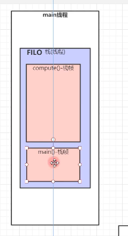
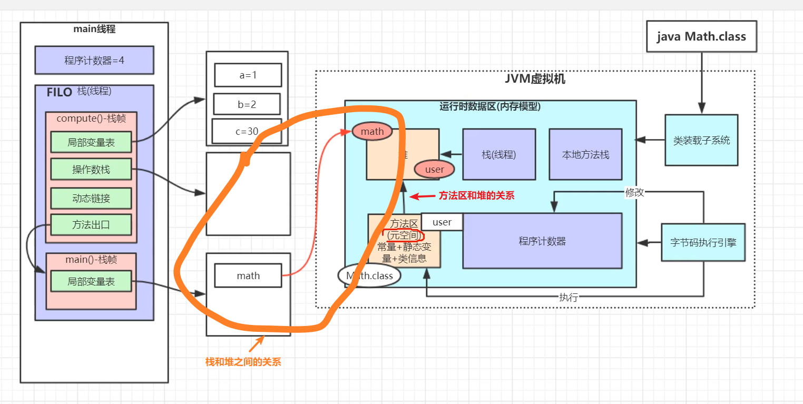

# 运行时数据区(内存结构)

[[TOC]]

## 堆

所有对象都在这里分配内存，是垃圾收集的主要区域("GC 堆")。 

现代的垃圾收集器基本都是采用分代收集算法，针对不同类型的对象采取不同的垃圾回收算法，可以将堆分成两块: 

- 新生代(Young Generation) 
 
- 老年代(Old Generation) 

新生代可以继续划分成以下三个空间:
 
- Eden(伊甸园)
  
- From Survivor(幸存者)

-To Survivor

堆不需要连续内存，并且可以动态增加其内存，增加失败会抛出 OutOfMemoryError 异常。
 
 可以通过 -Xms 和 -Xmx 两个虚拟机参数来指定一个程序的堆内存大小，第一个参数设置初始值，第二个参数设置最大值。

成员变量存储在堆中的对象里面，由垃圾回收器负责回收。

## Java虚拟机栈(线程栈)

方法的调用符合数据结构中的栈的特点FILO(先进后出) 

栈的内部结构由一块一块的栈帧组成

 

一个方法对应一块栈帧内存区域，用来放方法当中自己的局部变量等信息

每个 Java 方法在执行的同时会创建一个**栈帧**用于存储局部变量表、操作数栈、动态链接、方法出口等信息，
从调用直至执行完成的过程，就对应着一个栈帧在 Java 虚拟机栈中入栈和出栈的过程。

局部变量表:存放方法当中的局部变量  比如int a=1  int b=2   **存放分配到堆当中的对象的引用(指针)[内存地址]**

操作数栈:放操作数的区域 进行操作数计算    

动态链接

方法出口:记录方法被调用的位置，当方法执行完之后再回到被调用的地方

## 方法区(元空间)

用于存放被类加载子系统加载的**类信息**、**常量**、**静态变量**、即时编译器编译后的代码等数据。

运行时常量池是方法区的一部分。
 
Class 文件中的常量池(编译器生成的各种字面量和符号引用)会在类加载后被放入这个区域。
  
除了在编译期生成的常量，还允许动态生成，例如 String 类的 intern()。

 
 
 ## 程序计数器
 
 也是一片内存区域，存储的是记录当前线程指令执行的行号 
 
 由字节码执行引擎来修改操作
 
 为什么会有程序计数器？ 当多线程切换执行时，切换回当前线程，则需要调出之前线程执行的位置。
 
 ## 本地方法栈
 
 本地方法一般是用其它语言(C、C++ 或汇编语言等)编写的，并且被编译为基于本机硬件和操作系统的程序，对待这些方法需要特别处理。 
 
 本地方法栈与 Java 虚拟机栈类似，它们之间的区别只不过是本地方法栈为本地方法服务。

