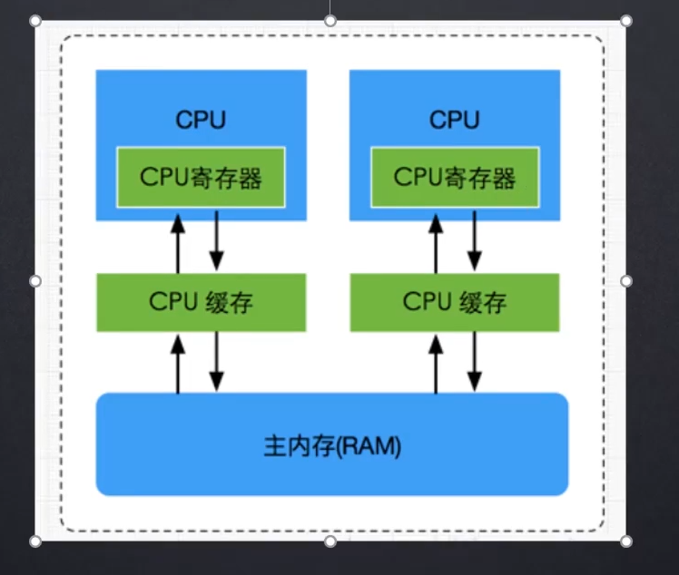
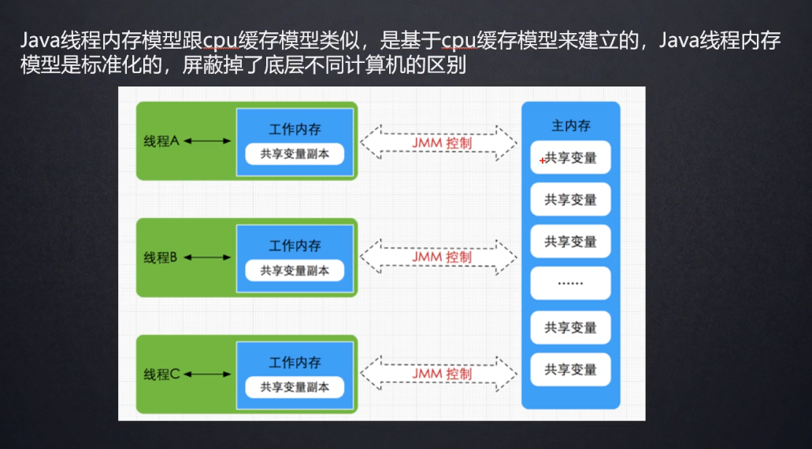
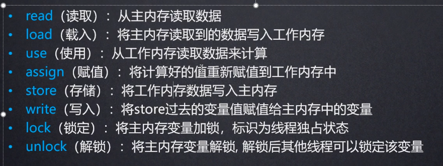
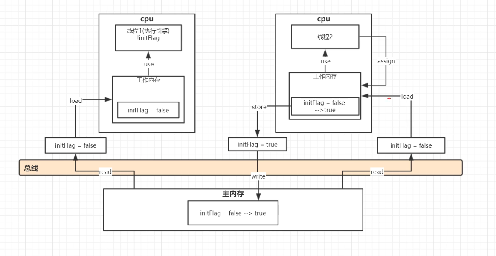
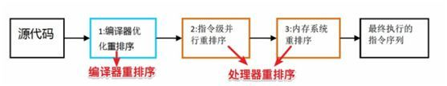

Java 内存模型

[[TOC]]

并发编程模型两大关键问题 

- 线程间的通信:即线程间通过写-读内存中的公共状态来隐式进行通信

1.隐式:共享内存 ——> java的并发采用的是共享内存模型:JMM

2.显示:消息传递 ——>即线程间必须通过明确的发送消息来显式进行通信

- 线程间的同步:同步是指程序用于控制不同线程之间操作发生相对顺序的机制

共享内存中:需显式指定方法或者代码需要在线程之间互斥执行

消息传递中，则是隐式。

## 多核并发缓存架构(硬件内存结构)

 

一个CPU一核

CPU和主内存通信

后来加入高速缓存，CPU通过高速缓存和主内存通信  高速缓存运算速度接近cpu

通常，当CPU需要访问主存储器时，它会将部分主存储器读入其CPU缓存。 它甚至可以将部分缓存读入其内部寄存器，然后对其执行操作。 
当CPU需要将结果写回主存储器时，它会将值从其内部寄存器刷新到高速缓冲存储器，并在某些时候将值刷新回主存储器。

## JMM 线程内存模型

 

> java线程内存模型跟cpu缓存模型类似,是基于cpu缓存模型来建立的。

``` java
package JVM.jmm;

/** volatile可见性
 * @ClassName VolatileVisibilityTest
 * @Description TODO
 * @Version 1.0
 **/
public class VolatileVisibilityTest {

    private static volatile boolean initFlag = false;

    public static void main(String[] args) throws InterruptedException {
        new Thread(new Runnable() {
            @Override
            public void run() {
                System.err.println("wait data ...");
                while (!initFlag){

                }
                System.err.println("===============success");
            }
        }).start();

        Thread.sleep(2000);

        new Thread(new Runnable() {
            @Override
            public void run() {
                prepareData();
            }
        }).start();
    }

    public static void prepareData(){
        System.err.println("prepareing data ...");
        initFlag = true;
        System.err.println("prepare data end ...");

    }
}
```
最开始 两个线程的工作内存当中都存储着 initFlag为false的共享变量副本

 
 
  
 
 MESI缓存一致性协议
 
 多个cpu从主内存读取到同一个数据到各自的高速缓存，当其中的某个cpu修改了缓存里的数据，该数据会马上同步回主内存，
 其他cpu通过总线嗅探机制可以感知到数据的变化从而将自己缓存里的数据失效
 
 JMM缓存不一致问题
 
 解决缓存一致性问题，有两种方式：
 
1. 通过在总线加LOCK#锁的方式
 
 　　在早期的CPU当中，是通过在总线上加LOCK#锁的形式来解决缓存不一致的问题。因为CPU和其他部件进行通信都是通过总线来进行的，如果对总线加LOCK#锁的话，也就是说阻塞了其他CPU对其他部件访问（如内存），从而使得只能有一个CPU能使用这个变量的内存。比如上面例子中 如果一个线程在执行 i = i +1，如果在执行这段代码的过程中，在总线上发出了LCOK#锁的信号，那么只有等待这段代码完全执行完毕之后，其他CPU才能从变量i所在的内存读取变量，然后进行相应的操作。这样就解决了缓存不一致的问题。
 
2. 通过缓存一致性协议
 
 　　上面说了，LOCK#会锁总线，实际上这不现实，因为锁总线效率太低了。因此最好能做到：使用多组缓存，但是它们的行为看起来只有一组缓存那样。缓存一致性协议就是为了做到这一点而设计的，就像名称所暗示的那样，这类协议就是要使多组缓存的内容保持一致。缓存一致性协议有多种，但是日常处理的大多数计算机设备都属于"嗅探（snooping）"协议，基本思想是：
 
 　　所有内存的传输都发生在一条共享的总线上，而所有的处理器都能看到这条总线：缓存本身是独立的，但是内存是共享资源，所有的内存访问都要经过仲裁（同一个指令周期中，只有一个CPU缓存可以读写内存）。CPU缓存不仅仅在做内存传输的时候才与总线打交道，而是不停在嗅探总线上发生的数据交换，跟踪其他缓存在做什么。所以当一个缓存代表它所属的处理器去读写内存时，其它处理器都会得到通知，它们以此来使自己的缓存保持同步。只要某个处理器一写内存，其它处理器马上知道这块内存在它们的缓存段中已失效。
 
 ### 指令重排序
 
>理解重排序前这个概念前，我们先转换场景，从java内存模型走出来，来到硬件CPU这个维度。

#### 基本概念：

在执行程序时为了提高性能，编译器和处理器常常会对指令做重排序（简单理解就是原本我们写的代码指令执行顺序应该是A→B→C，
但是现在的CPU都是多核CPU，为了秀下优越，为了提高并行度，为了提高性能等，可能会出现指令顺序变为B→A→C等其他情况）。

当然CPU们也不是随便就去重排序，需要满足以下两个条件(遵循的规则):

1. 在单线程环境下不能改变程序运行的结果；

2. 存在数据依赖关系的不允许重排序

#### 重排序分三类：

1、**编译器优化的重排序**。编译器在不改变**单线程**程序语义的前提下，可以重新安排语句的执行顺序

2、**指令级并行的重排序**。现代处理器采用了指令级并行技术来将多条指令重叠执行。如果不存在**数据依赖性**，
处理器可以改变语句对应机器指令的执行顺序。

3、**内存系统的重排序**。由于处理器使用缓存和读／写缓冲区，这使得**加载和存储操作**看上去可能是在乱序执行。

从 Java 源代码到最终实际执行的指令序列，会分别经历下面三种重排序：



**那么重排序会遵循什么样的规则？**

#### as-if-serial

as-if-serial语义的意思是：

不管怎么重排序，（单线程）程序的执行结果不能被改变。编译器，runtime和处理器都必须遵守as-if-serial语义。
OK，这就相当于给CPU们定下规则。不要随便重排序。要满足我这个as-if-serial的前置条件，才能重排序。  

as-if-serial语义把单线程程序保护了起来，遵守as-if-serial语义的编译器，runtime和处理器共同为编写单线程程序的程序员创建了一个幻觉：
单线程程序是按程序的顺序来执行的。as-if-serial语义使程序员不必担心单线程中重排序的问题干扰他们，也无需担心内存可见性问题。

注意：as-if-serial**只保证单线程环境**，多线程环境下无效。那多线程，并发编程下怎么办？

### 多线程下导致的问题及解决办法

**上面的这些重排序都可能导致多线程程序出现内存可见性问题，JMM那么如何解决？**

- 对于编译器重排序，JMM 的编译器重排序规则会**禁止特定类型的编译器重排序**（不是所有的编译器重排序都要禁止）。

- 对于处理器重排序，JMM 的处理器重排序规则会要求 Java 编译器在生成指令序列时，**插入特定类型的内存屏障指令**，
通过内存屏障指令来禁止特定类型的处理器重排序（不是所有的处理器重排序都要禁止）。

**JMM属于语言级的内存模型，它确保在不同的编译器和不同的处理器平台之上，通过禁止特定类型的编译器重排序和处理器重排序，为程序员提供一致的内存可见性保证。**

### 什么是内存屏障？

内存屏障（Memory Barrier）是一种CPU指令.

内存屏障也称为内存栅栏或栅栏指令，是一种屏障指令，它使CPU或编译器对屏障指令之前和之后发出的内存操作执行一个排序约束。

实际运用场景

volatile便是基于内存屏障实现的。

**观察加入volatile关键字和没有加入volatile关键字时所生成的汇编代码发现，加入volatile关键字时，会多出一个lock前缀指令**，这个指令就相当于一个内存屏障。具体表现为：

- 当**写**一个volatile 变量时，JMM 会把该线程对应的本地内存中的共享变量值**立即刷新**到主内存中。

- 当**读**一个volatile 变量时，JMM 会把该线程对应的**本地内存设置为无效，直接从主内存中读取共享变量**

从而保证了，如果某个线程对volatile修饰的共享变量进行更新，那么其他线程可以立马看到这个更新，这就是**所谓的线程可见性**。

### happens-before原则(先行发生原则)

从jdk5开始，java使用新的JSR-133内存模型，基于happens-before的概念来阐述操作之间的内存可见性。

换句话说，在JMM中，如果一个操作执行的结果需要对另一个操作可见，那么这两个操作之间必须存在happens-before关系。

happens-before原则是JMM中非常重要的原则，它是判断数据是否存在竞争、线程是否安全的主要依据，保证了多线程环境下的可见性。

### as-if-serial和happens-before小结

- as-if-serial语义保证单线程内程序的执行结果不被改变

- happens-before关系保证正确同步的多线程程序的执行结果不被改变。

- 其实都是为了在不改变程序执行结果的前提下，尽可能地提高程序执行的并行度。


