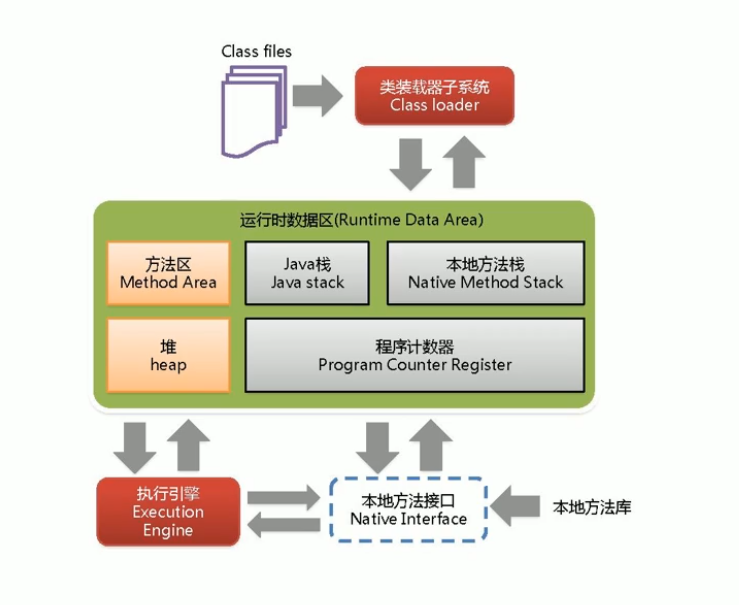
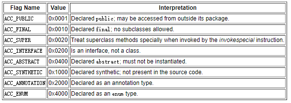

# JVM 核心问题

[[TOC]]

## 请谈谈你对JVM的理解？Java8的虚拟机有什么更新？

::: tip 请谈谈你对JVM的理解？Java8的虚拟机有什么更新？

Java虚拟机（JVM）是运行 Java 字节码的虚拟机。JVM有针对不同系统的特定实现（Windows，Linux，macOS），目的是使用相同的字节码，它们都会给出相同的结果。

- 什么是字节码?采用字节码的好处是什么?

>在 Java 中，JVM可以理解的代码就叫做字节码（即扩展名为 .class 的文件），它不面向任何特定的处理器，只面向虚拟机。Java 语言通过字节码的方式，
在一定程度上解决了传统解释型语言执行效率低的问题，同时又保留了解释型语言可移植的特点。所以 Java 程序运行时比较高效，而且，由于字节码并不针对一种特定的机器，
因此，Java程序无须重新编译便可在多种不同操作系统的计算机上运行。

- Java 程序从源代码到运行一般有下面3步：

 

我们需要格外注意的是 .class->机器码 这一步。在这一步 JVM 类加载器首先加载字节码文件，然后通过解释器逐行解释执行，这种方式的执行速度会相对比较慢。
而且，有些方法和代码块是经常需要被调用的(也就是所谓的热点代码)，所以后面引进了 JIT 编译器，而JIT 属于运行时编译。当 JIT 编译器完成第一次编译后，
其会将字节码对应的机器码保存下来，下次可以直接使用。而我们知道，机器码的运行效率肯定是高于 Java 解释器的。这也解释了我们为什么经常会说 Java 是编译与解释共存的语言。

>HotSpot采用了惰性评估(Lazy Evaluation)的做法，根据二八定律，消耗大部分系统资源的只有那一小部分的代码（热点代码），而这也就是JIT所需要编译的部分。
JVM会根据代码每次被执行的情况收集信息并相应地做出一些优化，因此执行的次数越多，它的速度就越快。JDK 9引入了一种新的编译模式AOT(Ahead of Time Compilation)，
它是直接将字节码编译成机器码，这样就避免了JIT预热等各方面的开销。JDK支持分层编译和AOT协作使用。但是 ，AOT 编译器的编译质量是肯定比不上 JIT 编译器的。

**总结：**

Java虚拟机（JVM）是运行 Java 字节码的虚拟机。JVM有针对不同系统的特定实现（Windows，Linux，macOS），目的是使用相同的字节码，它们都会给出相同的结果。
字节码和不同系统的 JVM 实现是 Java 语言“一次编译，随处可以运行”的关键所在。 

:::

## 说一下 JVM 的主要组成部分？及其作用？

::: tip 说一下 JVM 的主要组成部分？及其作用？
 
 
 类加载器（ClassLoader）
 
 运行时数据区（Runtime Data Area） 
 
 执行引擎（Execution Engine） 
 
 本地库接口（Native Interface） 
 
 组件的作用：首先通过类加载器（ClassLoader）会把 Java 代码转换成字节码，运行时数据区（Runtime Data Area）再把字节码加载到内存中，
 而字节码文件只是 JVM 的一套指令集规范，并不能直接交给底层操作系统去执行，因此需要特定的命令解析器执行引擎（Execution Engine），
 将字节码翻译成底层系统指令，再交由 CPU 去执行，而这个过程中需要调用其他语言的本地库接口（Native Interface）来实现整个程序的功能。

:::

## 从 JVM 角度说进程和线程之间的关系

::: tip 从 JVM 角度说进程和线程之间的关系

下图是 Java 内存区域，通过下图我们从 JVM 的角度来说一下线程和进程之间的关系。

 

从上图可以看出：一个进程中可以有多个线程，多个线程共享进程的**堆**和**方法区** (JDK1.8 之后的元空间)资源，但是每个线程有自己的**程序计数器**、**虚拟机栈** 和 **本地方法栈**。

下面来思考这样一个问题：为什么**程序计数器**、**虚拟机栈**和**本地方法栈**是线程私有的呢？为什么堆和方法区是线程共享的呢？

- 虚拟机栈和本地方法栈为什么是私有的?

**虚拟机栈**：每个 Java 方法在执行的同时会创建一个栈帧用于存储局部变量表、操作数栈、常量池引用等信息。从方法调用直至执行完成的过程，就对应着一个栈帧在 Java 虚拟机栈中入栈和出栈的过程。

**本地方法栈**：和虚拟机栈所发挥的作用非常相似，区别是： **虚拟机栈为虚拟机执行 Java 方法 （也就是字节码）服务，而本地方法栈则为虚拟机使用到的 Native 方法服务。**
 在 HotSpot 虚拟机中和 Java 虚拟机栈合二为一。

所以，<u>**为了保证线程中的局部变量不被别的线程访问到**，</u>虚拟机栈和本地方法栈是线程私有的。

- 一句话简单了解堆和方法区

堆和方法区是所有线程共享的资源，其中堆是进程中最大的一块内存，主要用于存放新创建的对象 (所有对象都在这里分配内存)，方法区主要用于存放已被加载的类信息、常量、静态变量、即时编译器编译后的代码等数据。

:::

## 说一下 JVM 运行时数据区？

::: tip 说一下 JVM 运行时数据区？
[Java内存结构](Memory.md)
:::

## 说一下堆栈的区别？

::: tip 说一下堆栈的区别？

功能方面：堆是用来存放对象的，栈是用来执行程序的。

共享性：堆是线程共享的，栈是线程私有的。

空间大小：堆大小远远大于栈。

:::

## 队列和栈是什么？有什么区别？
 
::: tip 队列和栈是什么？有什么区别？

队列和栈是一种数据结构

队列和栈都是被用来预存储数据的。

队列是先进先出 类似水流经过水管

栈是后进先出 类似水杯

:::

## 程序计数器为什么是私有的?

::: tip 程序计数器为什么是私有的?
程序计数器主要有下面两个作用：

1. 字节码解释器通过改变程序计数器来依次读取指令，从而实现代码的流程控制，如：顺序执行、选择、循环、异常处理。

2. 在多线程的情况下，程序计数器用于记录当前线程执行的位置，从而当线程被切换回来的时候能够知道该线程上次运行到哪儿了。

需要注意的是，如果执行的是 native 方法，那么程序计数器记录的是 undefined 地址，只有执行的是 Java 代码时程序计数器记录的才是下一条指令的地址。

所以，程序计数器私有主要是为了**线程切换后能恢复到正确的执行位置。**
:::

## Java 中都有哪些引用类型？

::: tip Java 中都有哪些引用类型？

强引用：发生 gc 的时候不会被回收。

软引用：有用但不是必须的对象，在发生内存溢出之前会被回收。

弱引用：有用但不是必须的对象，在下一次GC时会被回收。

虚引用（幽灵引用/幻影引用）：无法通过虚引用获得对象，用 PhantomReference 现虚引用，虚引用的用途是在 gc 时返回一个通知。

:::

## 简单的介绍一下强引用、软引用、弱引用、虚引用（虚引用与软引用和弱引用的区别、使用软引用能带来的好处）？

::: tip Java 简单的介绍一下强引用、软引用、弱引用、虚引用（虚引用与软引用和弱引用的区别、使用软引用能带来的好处）？
无论是通过引用计数法判断对象引用数量，还是通过可达性分析法判断对象的引用链是否可达，判定对象的存活都与“引用”有关。

JDK1.2 之前，Java 中引用的定义很传统：如果 reference 类型的数据存储的数值代表的是另一块内存的起始地址，就称这块内存代表一个引用。

JDK1.2 以后，Java 对引用的概念进行了扩充，将引用分为强引用、软引用、弱引用、虚引用四种（引用强度逐渐减弱）

1. 强引用（StrongReference）

以前我们使用的大部分引用实际上都是强引用，这是使用最普遍的引用。如果一个对象具有强引用，那就类似于**必不可少的生活用品**，
垃圾回收器绝不会回收它。当内存空间不足，Java 虚拟机宁愿抛出 OutOfMemoryError 错误，使程序异常终止，也不会靠随意回收具有强引用的对象来解决内存不足问题。

2. 软引用（SoftReference）

如果一个对象只具有软引用，那就类似于**可有可无的生活用品**。如果内存空间足够，垃圾回收器就不会回收它，如果内存空间不足了，
就会回收这些对象的内存。只要垃圾回收器没有回收它，该对象就可以被程序使用。软引用可用来实现内存敏感的高速缓存。

软引用可以和一个引用队列（ReferenceQueue）联合使用，如果软引用所引用的对象被垃圾回收，JAVA 虚拟机就会把这个软引用加入到与之关联的引用队列中。

``` java
MyObject aRef = new MyObject();
SoftReference aSoftRef = new SoftReference(aRef); 
```
3. 弱引用（WeakReference）

如果一个对象只具有弱引用，那就类似于**可有可无的生活用品**。弱引用与软引用的区别在于：只具有弱引用的对象拥有更短暂的生命周期。
在垃圾回收器线程扫描它所管辖的内存区域的过程中，一旦发现了只具有弱引用的对象，不管当前内存空间足够与否，
都会回收它的内存。不过，由于垃圾回收器是一个优先级很低的线程， 因此不一定会很快发现那些只具有弱引用的对象。

弱引用可以和一个引用队列（ReferenceQueue）联合使用，如果弱引用所引用的对象被垃圾回收，Java 虚拟机就会把这个弱引用加入到与之关联的引用队列中。

4. 虚引用（PhantomReference）

"虚引用"顾名思义，就是形同虚设，与其他几种引用都不同，虚引用并不会决定对象的生命周期。如果一个对象仅持有虚引用，那么它就和没有任何引用一样，
在任何时候都可能被垃圾回收。

**虚引用主要用来跟踪对象被垃圾回收的活动。**

**虚引用与软引用和弱引用的一个区别在于：** 虚引用必须和引用队列（ReferenceQueue）联合使用。当垃圾回收器准备回收一个对象时，
如果发现它还有虚引用，就会在回收对象的内存之前，把这个虚引用加入到与之关联的引用队列中。
程序可以通过判断引用队列中是否已经加入了虚引用，来了解被引用的对象是否将要被垃圾回收。
程序如果发现某个虚引用已经被加入到引用队列，那么就可以在所引用的对象的内存被回收之前采取必要的行动。 

特别注意，在程序设计中一般很少使用弱引用与虚引用，使用软引用的情况较多，这是因为**软引用可以加速 JVM 对垃圾内存的回收速度，
可以维护系统的运行安全，防止内存溢出（OutOfMemory）等问题的产生**


:::

## Java 对象的创建过程？

::: tip Java 对象的创建过程？

- Step1:类加载检查

虚拟机遇到一条 new 指令时，首先将去检查这个指令的参数是否能在常量池中定位到这个类的符号引用，并且检查这个符号引用代表的类是否已被加载过、解析和初始化过。
如果没有，那必须先执行相应的类加载过程。

- Step2:分配内存

在**类加载检查**通过后，接下来虚拟机将为新生对象**分配内存**。对象所需的内存大小在类加载完成后便可确定，为对象分配空间的任务等同于把一块确定大小的内存从 Java 堆中划分出来。
**分配方式**有 **“指针碰撞”** 和 **“空闲列表”** 两种，**选择哪种分配方式由 Java 堆是否规整决定，而 Java 堆是否规整又由所采用的垃圾收集器是否带有压缩整理功能决定。**

**内存分配的两种方式：（补充内容，需要掌握）**

选择以上两种方式中的哪一种，取决于 Java 堆内存是否规整。而 Java 堆内存是否规整，取决于 GC 收集器的算法是"标记-清除"，还是"标记-整理"（也称作"标记-压缩"），
值得注意的是，复制算法内存也是规整的

**内存分配并发问题(补充内容，需要掌握)**
在创建对象的时候有一个很重要的问题，就是线程安全，因为在实际开发过程中，创建对象是很频繁的事情，作为虚拟机来说，必须要保证线程是安全的，通常来讲，虚拟机采用两种方式来保证线程安全：

- **CAS+失败重试**： CAS 是乐观锁的一种实现方式。所谓乐观锁就是，每次不加锁而是假设没有冲突而去完成某项操作，如果因为冲突失败就重试，直到成功为止。
虚拟机采用 CAS 配上失败重试的方式保证更新操作的原子性。

- **TLAB**： 为每一个线程预先在 Eden 区分配一块儿内存，JVM 在给线程中的对象分配内存时，首先在 TLAB 分配，当对象大于 TLAB 中的剩余内存或 TLAB 的内存已用尽时，再采用上述的 CAS 进行内存分配

- Step3:初始化零值

内存分配完成后，虚拟机需要将分配到的内存空间都初始化为零值（不包括对象头），这一步操作保证了对象的实例字段在 Java 代码中可以不赋初始值就直接使用，
程序能访问到这些字段的数据类型所对应的零值。

- Step4:设置对象头

初始化零值完成之后，**虚拟机要对对象进行必要的设置**，例如这个对象是那个类的实例、如何才能找到类的元数据信息、对象的哈希码、对象的 GC 分代年龄等信息。
 **这些信息存放在对象头中。** 另外，根据虚拟机当前运行状态的不同，如是否启用偏向锁等，对象头会有不同的设置方式。

- Step5:执行 init 方法

在上面工作都完成之后，从虚拟机的视角来看，一个新的对象已经产生了，但从 Java 程序的视角来看，对象创建才刚开始， 方法还没有执行，所有的字段都还为零。
所以一般来说，执行 new 指令之后会接着执行 方法，把对象按照程序员的意愿进行初始化，这样一个真正可用的对象才算完全产生出来。
:::

## 对象的访问定位的两种方式

::: tip 对象的访问定位的两种方式
java对象在访问的时候，我们需要通过java虚拟机栈的reference类型的数据去操作具体的对象。
由于reference类型在java虚拟机规范中只规定了一个对象的引用，并没有定义这个这个引用应该通过那种方式去定位、
访问java堆中的具体对象实例，所以一般的访问方式也是取决与java虚拟机的类型。目前主流的访问方式有通过句柄和直接指针两种方式。

1. 句柄访问

使用句柄访问方式，java堆将会划分出来一部分内存去来作为句柄池，reference中存储的就是对象的句柄地址。
而句柄中则包含对象实例数据的地址和对象类型数据（如对象的类型，实现的接口、方法、父类、field等）的具体地址信息。
下边我以一个例子来简单的说明一下：

Object obj = new Object();

Object obj表示一个本地引用，存储在java栈的本地便变量表中，表示一个reference类型的数据。

new Object()作为实例对象存放在java堆中，同时java堆中还存储了Object类的信息（对象类型、实现接口、方法等）的具体地址信息，这些地址信息所执行的数据类型存储在方法区中。

2. 直接指针访问

如果使用指针访问，那么java堆对象的布局中就必须考虑如何放置访问类型的相关信息（如对象的类型，实现的接口、方法、父类、field等），
而reference中存储的就是对象的地址。


这两种访问方式各有利弊，使用句柄访最大的好处是reference中存储着稳定的句柄地址，当对象移动之后（垃圾收集时移动对象是非常普遍的行为），
只需要改变句柄中的对象实例地址即可，reference不用修改。

使用指针访问的好处是访问速度快，它减少了一次指针定位的时间开销，由于java是面向对象的语言，
在开发中java对象的访问非常的频繁，因此这类开销积少成多也是非常可观的，反之则提升访问速度。
:::

## 如何判断对象是否死亡（两种方法）？怎么判断对象是否可以被回收？

::: tip 如何判断对象是否死亡（两种方法）？怎么判断对象是否可以被回收？
堆中几乎放着所有的对象实例，对堆垃圾回收前的第一步就是要判断哪些对象已经死亡（即不能再被任何途径使用的对象）。

1. 引用计数法

给对象中添加一个引用计数器，每当有一个地方引用它，计数器就加 1；当引用失效，计数器就减 1；任何时候计数器为 0 的对象就是不可能再被使用的。

**这个方法实现简单，效率高，但是目前主流的虚拟机中并没有选择这个算法来管理内存，其最主要的原因是它很难解决对象之间相互循环引用的问题。**

 所谓对象之间的相互引用问题，如下面代码所示：除了对象 objA 和 objB 相互引用着对方之外，这两个对象之间再无任何引用。但是他们因为互相引用对方，
 导致它们的引用计数器都不为 0，于是引用计数算法无法通知 GC 回收器回收他们。

2. 可达性分析算法

这个算法的基本思想就是通过一系列的称为**GC Roots**的对象作为起点，从这些节点开始向下搜索，节点所走过的路径称为引用链，
当一个对象到 GC Roots 没有任何引用链相连的话，则证明此对象是不可用的。

:::

## 如何判断一个常量是废弃常量 ？

::: tip 如何判断一个常量是废弃常量 ？

运行时常量池主要回收的是废弃的常量。那么，我们如何判断一个常量是废弃常量呢？

假如在常量池中存在字符串 "abc"，如果当前没有任何 String 对象引用该字符串常量的话，就说明常量 "abc" 就是废弃常量，
如果这时发生内存回收的话而且有必要的话，"abc" 就会被系统清理出常量池。

注意：我们在 [可能是把 Java 内存区域讲的最清楚的一篇文章](https://mp.weixin.qq.com/s?__biz=Mzg2OTA0Njk0OA==&mid=2247484884&amp;idx=1&amp;sn=0d9b841ce0fc300c78ade2a87ffbfb46&source=41#wechat_redirect)
 也讲了 JDK1.7 及之后版本的 JVM 已经将运行时常量池从方法区中移了出来，
在 Java 堆（Heap）中开辟了一块区域存放运行时常量池。
:::

## 如何判断一个类是无用的类？

::: tip Java 如何判断一个类是无用的类？

方法区主要回收的是无用的类，那么如何判断一个类是无用的类的呢？

判定一个常量是否是“废弃常量”比较简单，而要判定一个类是否是“无用的类”的条件则相对苛刻许多。类需要同时满足下面 3 个条件才能算是 **“无用的类”** ：

- 该类所有的实例都已经被回收，也就是 Java 堆中不存在该类的任何实例。

- 加载该类的 ClassLoader 已经被回收。

- 该类对应的 java.lang.Class 对象没有在任何地方被引用，无法在任何地方通过反射访问该类的方法

虚拟机可以对满足上述 3 个条件的无用类进行回收，这里说的仅仅是“可以”，而并不是和对象一样不使用了就会必然被回收。
:::

## 说一下类装载的执行过程？

::: tip 说一下类装载的执行过程？ 
类装载分为以下 5 个步骤：
**加载**:根据查找路径找到相应的 class 文件然后导入；
**检查**：检查加载的 class 文件的正确性；
**准备**：给类中的静态变量分配内存空间；
**解析**：虚拟机将常量池中的符号引用替换成直接引用的过程。符号引用就理解为一个标示，而在直接引用直接指向内存中的地址；
**初始化**：对静态变量和静态代码块执行初始化工作。 

[Java类加载机制](ClassLoader.md)
:::

## 请概述一下Java 类文件结构？

::: tip 请概述一下Java 类文件结构？ 
在 Java 中，**JVM 可以理解的代码就叫做字节码（即扩展名为 .class 的文件）**，它不面向任何特定的处理器，只面向虚拟机。
Java 语言通过字节码的方式，在一定程度上解决了传统解释型语言执行效率低的问题，同时又保留了解释型语言可移植的特点。
所以 Java 程序运行时比较高效，而且，由于字节码并不针对一种特定的机器，因此，Java 程序无须重新编译便可在多种不同操作系统的计算机上运行。

Clojure（Lisp 语言的一种方言）、Groovy、Scala 等语言都是运行在 Java 虚拟机之上。下图展示了不同的语言被不同的编译器编译
成.class文件最终运行在 Java 虚拟机之上。.class文件的二进制格式可以使用 WinHex 查看。

 

****可以说.class文件是不同的语言在 Java 虚拟机之间的重要桥梁，同时也是支持 Java 跨平台很重要的一个原因。**
:::

## 请总结一下Class 文件结构？

::: tip 请总结一下Class 文件结构？ 
根据 Java 虚拟机规范，类文件由单个 ClassFile 结构组成：
``` java
ClassFile {
    u4             magic; //Class 文件的标志
    u2             minor_version;//Class 的小版本号
    u2             major_version;//Class 的大版本号
    u2             constant_pool_count;//常量池的数量
    cp_info        constant_pool[constant_pool_count-1];//常量池
    u2             access_flags;//Class 的访问标记
    u2             this_class;//当前类
    u2             super_class;//父类
    u2             interfaces_count;//接口
    u2             interfaces[interfaces_count];//一个类可以实现多个接口
    u2             fields_count;//Class 文件的字段属性
    field_info     fields[fields_count];//一个类会可以有个字段
    u2             methods_count;//Class 文件的方法数量
    method_info    methods[methods_count];//一个类可以有个多个方法
    u2             attributes_count;//此类的属性表中的属性数
    attribute_info attributes[attributes_count];//属性表集合
}
```
下面详细介绍一下 Class 文件结构涉及到的一些组件。

**Class文件字节码结构组织示意图**（之前在网上保存的，非常不错，原出处不明）：


 
**魔数** 
``` java
   u4             magic; //Class 文件的标志
```
每个 Class 文件的头四个字节称为魔数（Magic Number）,它的唯一作用是**确定这个文件是否为一个能被虚拟机接收的 Class 文件**。 

程序设计者很多时候都喜欢用一些特殊的数字表示固定的文件类型或者其它特殊的含义

**Class 文件版本**

``` java
    u2             minor_version;//Class 的小版本号
    u2             major_version;//Class 的大版本号
```
紧接着魔数的四个字节存储的是 Class 文件的版本号：第五和第六是**次版本号**，第七和第八是**主版本号**。

高版本的 Java 虚拟机可以执行低版本编译器生成的 Class 文件，但是低版本的 Java 虚拟机不能执行高版本编译器生成的 Class 文件。
所以，我们在实际开发的时候要确保开发的的 JDK 版本和生产环境的 JDK 版本保持一致。

**常量池**

``` java
    u2             constant_pool_count;//常量池的数量
    cp_info        constant_pool[constant_pool_count-1];//常量池
```
紧接着主次版本号之后的是常量池，常量池的数量是 constant_pool_count-1 **(常量池计数器是从1开始计数的，将第0项常量空出来是有特殊考虑的，索引值为0代表“不引用任何一个常量池项”）**。

常量池主要存放两大常量：字面量和符号引用。字面量比较接近于 Java 语言层面的的常量概念，如文本字符串、声明为 final 的常量值等。而符号引用则属于编译原理方面的概念。包括下面三类常量：

- 类和接口的全限定名

- 字段的名称和描述符

- 方法的名称和描述符

常量池中每一项常量都是一个表，这14种表有一个共同的特点：**开始的第一位是一个 u1 类型的标志位 -tag 来标识常量的类型，代表当前这个常量属于哪种常量类型．**

类型|标志（tag）|描述|
--|:--:|:--:|
CONSTANT_utf8_info|	1|	UTF-8编码的字符串|
CONSTANT_Integer_info|	3|	整形字面量|
CONSTANT_Float_info|	4|	浮点型字面量|
CONSTANT_Long_info|	５|	长整型字面量|
CONSTANT_Double_info|	６|	双精度浮点型字面量|
CONSTANT_Class_info|	７|	类或接口的符号引用|
CONSTANT_String_info|	８|	字符串类型字面量|
CONSTANT_Fieldref_info|	９|	字段的符号引用|
CONSTANT_Methodref_info|	10|	类中方法的符号引用|
CONSTANT_InterfaceMethodref_info|	11|	接口中方法的符号引用|
CONSTANT_NameAndType_info|	12|	字段或方法的符号引用|
CONSTANT_MothodType_info|	16|	标志方法类型|
CONSTANT_MethodHandle_info|	15|	表示方法句柄|
CONSTANT_InvokeDynamic_info|	18|	表示一个动态方法调用点|

**.class** 文件可以通过**javap -v class**类名 指令来看一下其常量池中的信息(**javap -v class类名-> temp.txt**：将结果输出到 temp.txt 文件)。

**访问标志**

在常量池结束之后，紧接着的两个字节代表访问标志，这个标志用于识别一些类或者接口层次的访问信息，
包括：这个 Class 是类还是接口，是否为 public 或者 abstract 类型，如果是类的话是否声明为 final 等等。

类访问和属性修饰符:



我们定义了一个 Employee 类

``` java
package top.snailclimb.bean;
public class Employee {
   ...
}
```

通过**javap -v class类名** 指令来看一下类的访问标志。


**当前类索引,父类索引与接口索引集合**
``` java
    u2             this_class;//当前类
    u2             super_class;//父类
    u2             interfaces_count;//接口
    u2             interfaces[interfaces_count];//一个雷可以实现多个接口
```

**类索引用于确定这个类的全限定名，父类索引用于确定这个类的父类的全限定名，由于 Java 语言的单继承，所以父类索引只有一个，
除了 java.lang.Object 之外，所有的 java 类都有父类，因此除了 java.lang.Object 外，所有 Java 类的父类索引都不为 0。**

**接口索引集合用来描述这个类实现了那些接口，这些被实现的接口将按implements(如果这个类本身是接口的话则是extends) 
后的接口顺序从左到右排列在接口索引集合中。**

**字段表集合**

``` java
    u2             fields_count;//Class 文件的字段的个数
    field_info     fields[fields_count];//一个类会可以有个字段
```
字段表（field info）用于描述接口或类中声明的变量。字段包括类级变量以及实例变量，但不包括在方法内部声明的局部变量。

**field info(字段表) 的结构:**


:::

::: tip Java 

:::

::: tip Java 

:::

::: tip Java 

:::
