# Java 位运算符
>Java 位运算符 &、|、^、~、<<、>> 
>主要运算符有以下：`与(&)`、`或(|)`、`异或(^)`、`取反(~)`、`左移(<<)`、`右移(>>)`。

[[TOC]]

## 与(&) 和 或(|)

### &（按位与）

`规则`:将两边的数转换为**二进制位**，然后运算最终值。运算规则即(**两个为真才为真**)1&1=1 , 1&0=0 , 0&1=0 , 0&0=0。

`举例`：

**4 & 7** 这个运算的结果是多少？
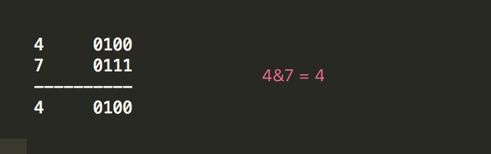

**3 & 5** 这个运算的结果是多少？
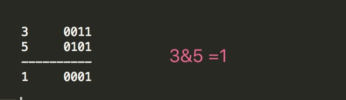

### |（按位或）

`规则` 将两边的数转换为**二进制位**，然后运算最终值。不同的是运算规则(**一个为真即为真**)1|0 = 1 , 1|1 = 1 , 0|0 = 0 , 0|1 = 1

`举例`

**3 | 6** 这个运算的结果是多少？

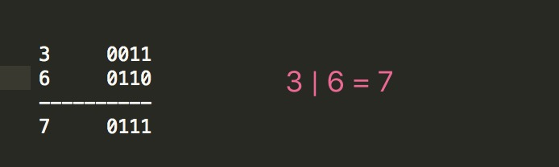

**5 | 9** 这个运算的结果是多少？

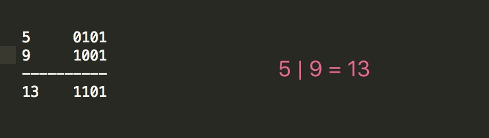

## 异或(^) 和 取反(~)

### 异或(^)

`规则`: 异就是不同，其运算规则为1^0 = 1 , 1^1 = 0 , 0^1 = 1 , 0^0 = 0 相同为0 不同为1

`举例`

**3 ^ 6** 这个运算的结果是多少？
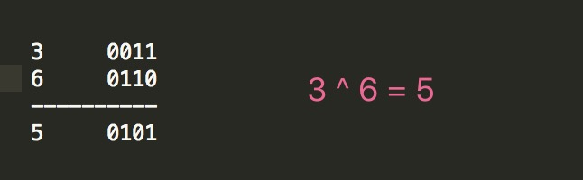

**5 ^ 9** 这个运算的结果是多少？
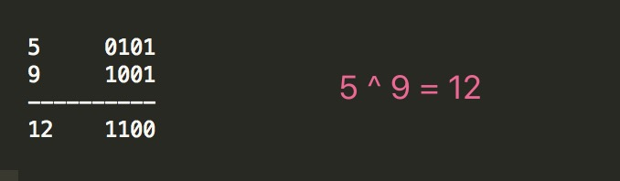

### 取反(~)

`规则`: 取反就是1为0,0为1

`举例`

**~5** 这个运算的结果是多少？
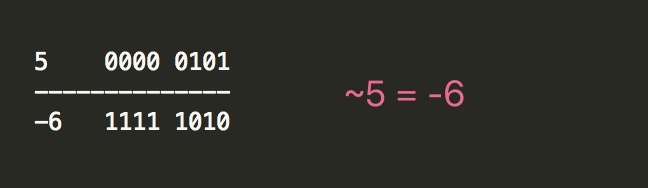
这个其实，就是把1变0，0变1。
注意：二进制中，最高位是符号位 1表示负数，0表示正数。

**~15** 这个运算的结果是多少？
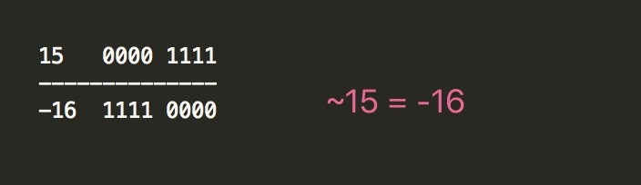

## 左移运算(<<) 和 右移运算(>>) 

### 左移运算(<<)

`规则` 左移就是把所有位向左移动几位。

`举例`

**6 << 2** 这个运算的结果是多少？
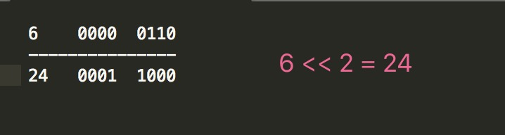

**9 << 2** 这个运算的结果是多少？
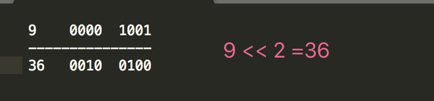

`公式` **M << n 其实可以这么算 M << n = M * 2^n**

### 右移运算(>>)

`规则` 这个跟左移运算大体是一样的,但是还是有点不同的，**不同点在于对于正数和负数补位的时候补的不一样，负数补1，正数补0**

`举例`
**12 >> 2** 这个运算的结果是多少？
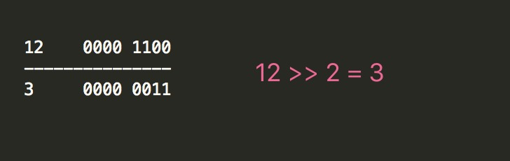

**-9 >> 2** 这个运算的结果是多少？
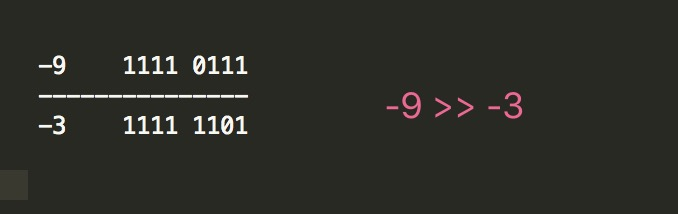

从这里就可以看出 **正数右移补0，负数右移补1**。

## 负数的进制表示

### 负的十进制转二进制

对于十进制的负数，如何用二进制来表示：

`思路三步曲`: **1、正数二进制 2、反码 3、反码+1**

`举例`

**-1** 如何转换成二进制？
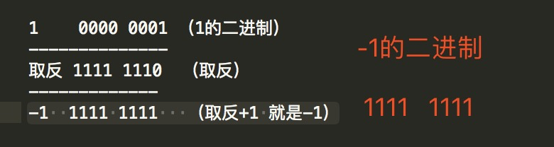

`说明` **－1在计算机里用二进制表达就是全1**

### 负的二进制转十进制

上面思路是负的十进制转二进制，那么同样负的二进制转10进制跟上面相反就可以了。

`思路三步曲` **1、负数的二进制码 2、二进制码-1 3、取反**

`举例`

**1111 1101** 如何转换成十进制？

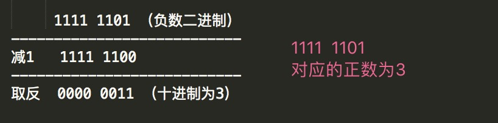