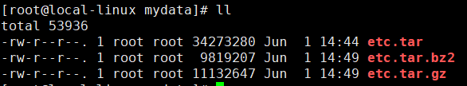

# 压缩与解压

[[TOC]]

## tar

- 将/etc文件夹中的文件归档到文件etc.tar（并不会进行压缩）：
``` shell script
tar -cvf /mydata/etc.tar /etc
```

- 用gzip压缩文件夹/etc中的文件到文件etc.tar.gz：
``` shell script
tar -zcvf /mydata/etc.tar.gz /etc
```

- 用bzip2压缩文件夹/etc到文件/etc.tar.bz2：
``` shell script
tar -jcvf /mydata/etc.tar.bz2 /etc
```


- 分页查看压缩包中内容（gzip）：
``` shell script
tar -ztvf /mydata/etc.tar.gz |more -c -10
```

- 解压文件到当前目录（gzip）：
``` shell script
tar -zxvf /mydata/etc.tar.gz
```

- 解压文件到指定目录（gzip）：
```shell script
tar -zxvf /mydata/etc.tar.gz -C /mydata/etc
```

## zip

在使用zip跟unzip命令之前先查看系统有没有安装这两个命令的包，没有的话要自己安装
查看有没有安装zip跟unzip命令的命令：

``` shell script
rpm -q zip unzip
```

### zip命令

基本用法：

zip [参数] [压缩包名] [压缩的目录或者文件的路径]

常用参数：

zip命令的常用参数
   |    |    | 
---|:--:|---:
-m|将文件压缩后，删除原文件|
-o|将压缩文件内的所有文件的最新变动时间设为压缩的时间|
-q|安静模式，在压缩的时候不显示指令执行的过程|
-r|递归压缩，将自定目录下的所有子文件以及文件一起处理|
-x|“文件列表”，压缩时排除文件列表中的文件|

### unzip命令

基本用法：

unzip [参数] [压缩文件]  （-d [目录]）  //如果不是用括号里面的内容，则解压文件在当前工作目录

常用参数：

unzip命令的常用参数
   |    |    | 
---|:--:|---:
-c|将解压缩的结果显示到屏幕上（显示每一个目录下的每一个文件的内容），同时对字符做适当的转换，但是并没有解压压缩包|
-l|显示压缩文件内所包含的文件|
-t|检查压缩文件是否正确|
-v|执行时显示压缩文件的详细信息|
-q|安静模式，执行时不显示任何信息|
-d|指定文件解压后存储的目录|
-x|指定不要处理压缩文件中的那些文件|

