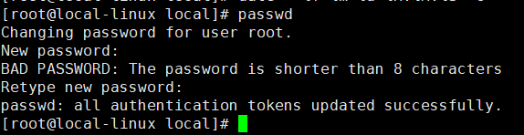
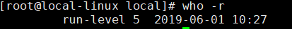
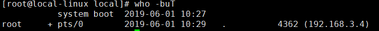

# 文件管理

[[TOC]]

## ls
列出当前目录(/)下的所有文件：
``` shell script
ls -l /
```

## pwd
获取目前所在工作目录的绝对路径

## cd
改变当前工作目录：
``` shell script
cd /usr/local
```

## date
显示或修改系统时间与日期；
``` shell script
date '+%Y-%m-%d %H:%M:%S'
```

## passwd
用于设置用户密码：
``` shell script
passwd root
```


## su
改变用户身份（切换到超级用户）：
``` shell script
su -
```

## clear
用于清除屏幕信息

## man
显示指定命令的帮助信息：
``` shell script
man ls
```

## who
- 查询系统处于什么运行级别：
``` shell script
who -r
```

- 显示目前登录到系统的用户：
``` shell script
who -buT
```


## free
显示系统内存状态（单位MB）：
``` shell script
free -m
```

## ps
显示系统进程运行动态：
``` shell script
ps -ef
```
查看sshd进程的运行动态：
``` shell script
ps -ef | grep sshd
```

## top
查看即时活跃的进程，类似Windows的任务管理器

## mkdir
创建目录

## more
用于文件过长时分页查看文件内容 每页10行查看boot.log文件
``` shell script
more -c -10 /var/log/boot.log
```

## cat
查看Linux启动日志文件文件，并标明行号：
``` shell script
cat -Ab /var/log/boot.log
```

## touch
创建text.txt文件：
``` shell script
touch text.txt
```

## rm
- 删除文件：
``` shell script
rm text.txt
```
- 强制删除某个目录及其子目录：
``` shell script
rm -rf testdir/
```

## cp
将test1目录复制到test2目录
``` shell script
cp -r /mydata/tes1 /mydata/test2
```

## mv
移动或覆盖文件：
``` shell script
mv text.txt text2.txt
```
