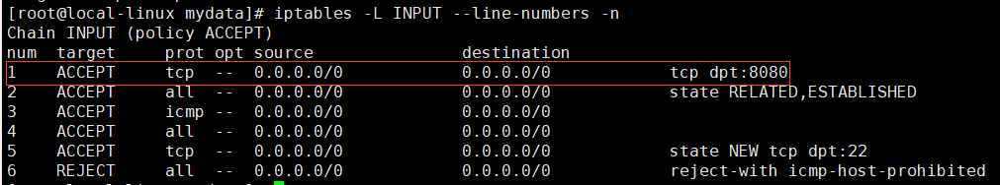
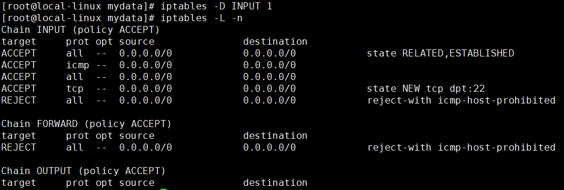

# 防火墙管理
>Linux中有两种防火墙软件，ConterOS7.0以上使用的是firewall，ConterOS7.0以下使用的是iptables，本文将分别介绍两种防火墙软件的使用。

[[TOC]]

## Firewall
- 开启防火墙：
``` shell script
systemctl start firewalld
```
- 关闭防火墙：
``` shell script
systemctl stop firewalld
```
- 查看防火墙状态：
``` shell script
systemctl status firewalld
```
- 设置开机启动：
``` shell script
systemctl enable firewalld
```
- 禁用开机启动：
``` shell script
systemctl disable firewalld
```
- 重启防火墙：
``` shell script
firewall-cmd --reload
```
- 开放端口（修改后需要重启防火墙方可生效）：
``` shell script
firewall-cmd --zone=public --add-port=8080/tcp --permanent
```
- 查看开放的端口：
``` shell script
firewall-cmd --list-ports
```
- 关闭端口：
``` shell script
firewall-cmd --zone=public --remove-port=8080/tcp --permanent
```
## Iptables
### 安装
>由于CenterOS7.0以上版本并没有预装Iptables,我们需要自行装。

- 安装前先关闭firewall防火墙 


- 安装iptables:
``` shell script
yum install iptables
```
- 安装iptables-services:
``` shell script
yum install iptables-services
```
### 使用
- 开启防火墙：
``` shell script
systemctl start iptables.service
```

- 关闭防火墙：
``` shell script
systemctl stop iptables.service
```
- 查看防火墙状态：
``` shell script
systemctl status iptables.service
```
- 设置开机启动：
``` shell script
systemctl enable iptables.service
```
- 禁用开机启动：
``` shell script
systemctl disable iptables.service
```
- 查看filter表的几条链规则(INPUT链可以看出开放了哪些端口)：
``` shell script
iptables -L -n
```

- 查看NAT表的链规则：
``` shell script
iptables -t nat -L -n
```

- 清除防火墙所有规则：
``` shell script
iptables -F
```
``` shell script
iptables -X
```
``` shell script
iptables -Z
```
- 给INPUT链添加规则（开放8080端口）：
``` shell script
iptables -I INPUT -p tcp --dport 8080 -j ACCEPT
```

- 查找规则所在行号：
``` shell script
iptables -L INPUT --line-numbers -n
```

- 根据行号删除过滤规则（关闭8080端口）：
``` shell script
iptables -D INPUT 1
```

