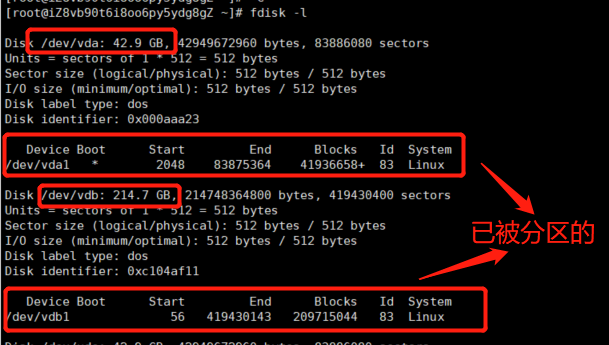
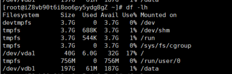
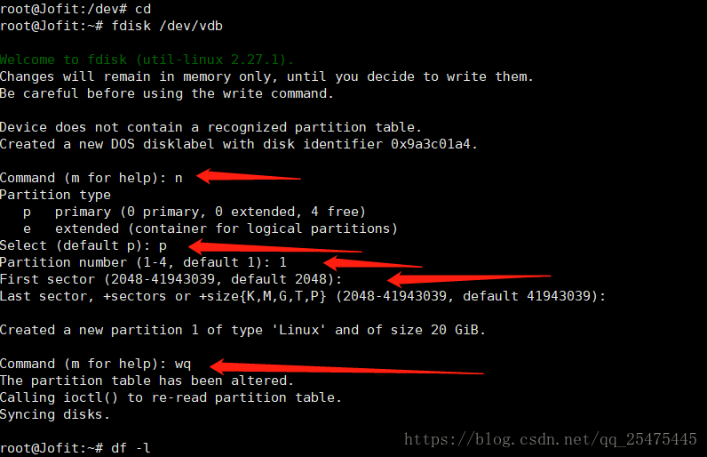
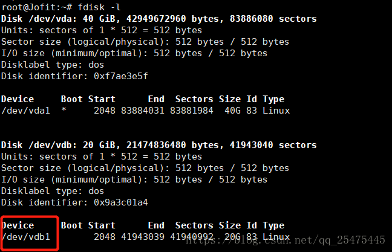
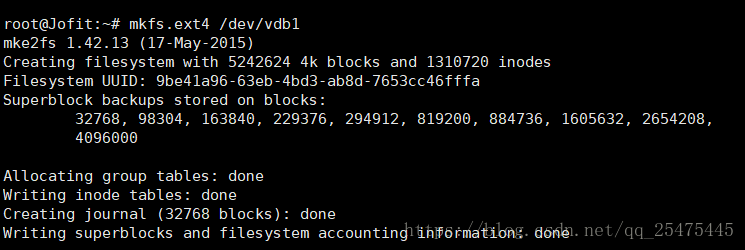
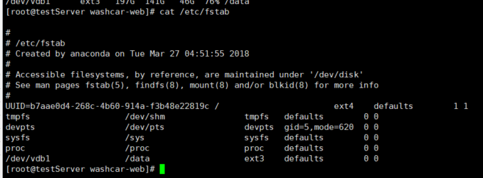

# 挂载

## 查看磁盘状态 

`fdisk -l `

## 查询服务器硬盘使用情况

` df -h`

` df -lh`

` df -hT`

## 将dev/vdb 数据盘分区并挂载

进入主目录上 cd 回车 执行  fdisk /dev/vdb 进行分区 操作分别为 n、p、1、回车、回车、wq

此处 n 为 按n进行分区 （e即分为逻辑分区，按p即分为主分区，我们要将这块盘分为主分区即输入p）

First Cylinder是选择该分区的起始磁盘数，这里可自定义也可不做选择，默认是1，如无特殊需求强烈建议选择默认，也就是1来分区（直接按回车）

>此时 输入：fdisk -l 新建分区已经出现

> 格式化分区：mkfs.ext4 /dev/vdb1

>挂载数据盘到文件（**在根目录下创建一个文件**）

`mount /dev/vdb1 /data`

`df -lh`

至此 完成

另外： 如果想每次系统重启都能自动挂载该分区可修改/etc/fstab文件，在最后加一段 /dev/vdb1    /www    ext4    defaults 1 2 
(格式说明：/dev/vdb1 代表哪个分区  ext4是该分区的格式 defaults 是挂载时所要设定的参数(只读，读写，启用quota等)，
输入defaults包括的参数有(rw、dev、exec、auto、nouser、async) ，1是使用dump是否要记录，0是不要。 2是开机时检查的顺序，
是boot系统文件就为1，其他文件系统都为2，如不要检查就为0,一般设置为0)

`cat /etc/fstab`

