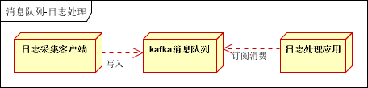

# 消息队列概念和使用场景

[[TOC]]

## 什么是消息队列

   **消息**即是信息的载体。为了让消息发送者和消息接收者都能够明白消息所承载的信息（消息发送者需要知道如何构造消息；
消息接收者需要知道如何解析消息），它们就需要按照一种统一的格式描述消息，这种统一的格式称之为**消息协议(JMS)**。所以，
有效的消息一定具有某一种格式；而没有格式的消息是没有意义的。

而消息从发送者到接收者的方式也有两种。一种我们可以称为**即时消息通讯**，也就是说消息从一端发出后（消息发送者）立即
就可以达到另一端（消息接收者），这种方式的具体实现就是**RPC（当然单纯的http通讯也满足这个定义）**；另一种方式称为**延迟消息通讯**，
即消息从某一端发出后，首先进入一个**容器**进行临时存储，当达到某种条件后，再由这个容器发送给**另一端**。 
这个容器的一种具体实现就是**消息队列**。

## 消息队列的应用场景
以下介绍消息队列在实际应用中常用的使用场景。**异步处理**，**应用解耦**，**流量削锋**和**消息通讯**四个场景。

### 异步处理

场景说明：用户注册后，需要发注册邮件和注册短信。传统的做法有两种1.**串行的方式**；2.**并行方式**。

（1）**串行方式**：将注册信息写入数据库成功后，发送注册邮件，再发送注册短信。以上三个任务全部完成后，返回给客户端。

（2）**并行方式**：将注册信息写入数据库成功后，发送注册邮件的同时，发送注册短信。以上三个任务完成后，返回给客户端。与串行的差别是，
并行的方式可以提高处理的时间。

假设三个业务节点每个使用50毫秒钟，不考虑网络等其他开销，则串行方式的时间是150毫秒，并行的时间可能是100毫秒。

因为CPU在单位时间内处理的请求数是一定的，假设CPU1秒内吞吐量是100次。则串行方式1秒内CPU可处理的请求量是7次（1000/150）。并行方式处理的请求量是10次（1000/100）。

**小结**：如以上案例描述，传统的方式系统的性能（并发量，吞吐量，响应时间）会有瓶颈。如何解决这个问题呢？

引入消息队列，将不是必须的业务逻辑，异步处理。改造后的架构如下：

按照以上约定，用户的响应时间相当于是注册信息写入数据库的时间，也就是50毫秒。注册邮件，发送短信写入消息队列后，直接返回，
因此写入消息队列的速度很快，基本可以忽略，因此用户的响应时间可能是50毫秒。因此架构改变后，系统的吞吐量提高到每秒20 QPS。
比串行提高了3倍，比并行提高了两倍。

### 应用解耦

场景说明：用户下单后，订单系统需要通知库存系统。传统的做法是，订单系统调用库存系统的接口。如下图：

传统模式的缺点：

1）  假如库存系统无法访问，则订单减库存将失败，从而导致订单失败；

2）  订单系统与库存系统耦合；

如何解决以上问题呢？引入应用消息队列后的方案，如下图：

- 订单系统：用户下单后，订单系统完成持久化处理，将消息写入消息队列，返回用户订单下单成功。
- 库存系统：订阅下单的消息，采用拉/推的方式，获取下单信息，库存系统根据下单信息，进行库存操作。
- 假如：在下单时库存系统不能正常使用。也不影响正常下单，因为下单后，订单系统写入消息队列就不再关心其他的后续操作了。
实现订单系统与库存系统的应用解耦。

### 流量削锋

流量削锋也是消息队列中的常用场景，一般在秒杀或团抢活动中使用广泛。

应用场景：秒杀活动，一般会因为流量过大，导致流量暴增，应用挂掉。为解决这个问题，一般需要在应用前端加入消息队列。
 
1. 可以控制活动的人数；

2. 可以缓解短时间内高流量压垮应用；

1. 用户的请求，服务器接收后，首先写入消息队列。假如消息队列长度超过最大数量，则直接抛弃用户请求或跳转到错误页面；

2. 秒杀业务根据消息队列中的请求信息，再做后续处理。

### 日志处理

日志处理是指将消息队列用在日志处理中，比如Kafka的应用，解决大量日志传输的问题。架构简化如下：

- 日志采集客户端，负责日志数据采集，定时写入Kafka队列；
- Kafka消息队列，负责日志数据的接收，存储和转发；
- 日志处理应用：订阅并消费kafka队列中的日志数据；

以下是新浪kafka日志处理应用案例：

- Kafka：接收用户日志的消息队列。
- Logstash：做日志解析，统一成JSON输出给Elasticsearch。
- Elasticsearch：实时日志分析服务的核心技术，一个schemaless，实时的数据存储服务，通过index组织数据，兼具强大的搜索和统计功能。
- Kibana：基于Elasticsearch的数据可视化组件，超强的数据可视化能力是众多公司选择ELK stack的重要原因。

## 消息模式

它有两种消息模式：**点对点模式**和**发布订阅模式**

### 点对点模式

点对点模式包含三个角色：**消息队列（Queue）**，**发送者(Sender)**，**接收者(Receiver)**。每个消息都被发送到一个特定的队列，
接收者从队列中获取消息。队列保留着消息，直到他们被消费或超时。

点对点的特点

1. 每个消息只有一个消费者（Consumer）(即一旦被消费，消息就不再在消息队列中)
2. 发送者和接收者之间在时间上没有依赖性，也就是说当发送者发送了消息之后，不管接收者有没有正在运行，它不会影响到消息被发送到队列
3. 接收者在成功接收消息之后需向队列应答成功

如果希望发送的每个消息都会被成功处理的话，那么需要P2P模式。

### 发布订阅模式

包含三个角色：**主题（Topic）**，**发布者（Publisher）**，**订阅者（Subscriber）** 。多个发布者将消息发送到Topic,系统将这些消息传递给多个订阅者。

Pub/Sub的特点

1. 每个消息可以有多个消费者
2. 发布者和订阅者之间有时间上的依赖性。针对某个主题（Topic）的订阅者，它必须创建一个订阅者之后，才能消费发布者的消息。
3. 为了消费消息，订阅者必须保持运行的状态。

为了缓和这样严格的时间相关性，JMS允许订阅者创建一个可持久化的订阅。这样，即使订阅者没有被激活（运行），它也能接收到发布者的消息。
如果希望发送的消息可以不被做任何处理、或者只被一个消息者处理、或者可以被多个消费者处理的话，那么可以采用Pub/Sub模型。

 

