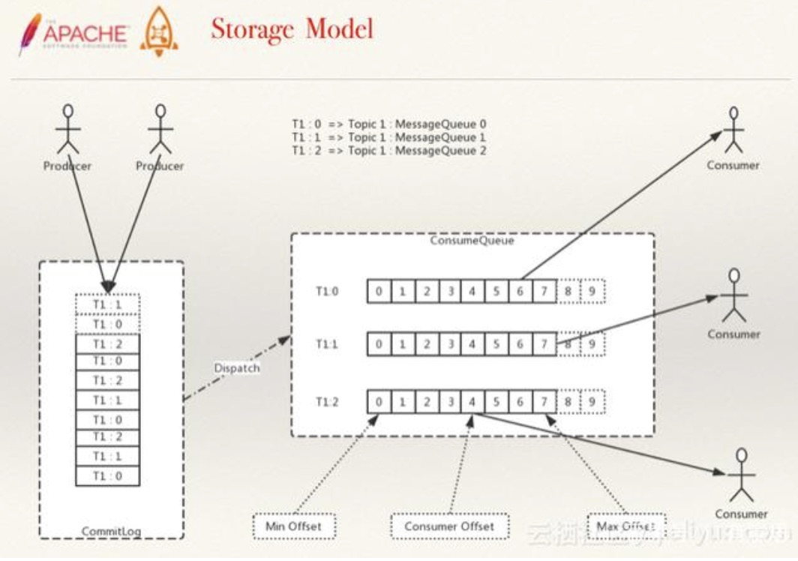

# RocketMQ 架构原理
>RocketMQ是阿里开源的分布式消息中间件，跟其它中间件相比，RocketMQ的特点是**纯JAVA实现；集群和HA(High Availability 高可用性)实现相对简单;
>在发生宕机和其它故障时消息丢失率更低。**

[[TOC]]

## RocketMQ专业术语 

先讲专业术语的含义，后面会画流程图来更好的去理解它们。

### Producer

消息生产者，位于用户的进程内，`Producer通过NameServer获取所有Broker的路由信息`，根据负载均衡策略选择将消息发到哪个Broker，然后调用Broker接口提交消息。

### Producer Group

生产者组，简单来说就是多个发送同一类消息的生产者称之为一个生产者组。

### Consumer

消息消费者，位于用户进程内。Consumer通过NameServer获取所有broker的路由信息后，向Broker发送Pull请求来获取消息数据。
Consumer可以以两种模式启动，**广播（Broadcast）和集群（Cluster），广播模式下，一条消息会发送给所有Consumer，集群模式下消息只会发送给一个Consumer。**

### Consumer Group

消费者组，和生产者类似，消费同一类消息的多个 Consumer 实例组成一个消费者组。

### Topic

Topic用于将消息按主题做划分，**Producer将消息发往指定的Topic，Consumer订阅该Topic就可以收到这条消息**。Topic跟发送方和消费方都没有强关联关系，
发送方可以同时往多个Topic投放消息，消费方也可以订阅多个Topic的消息。在RocketMQ中，**Topic是一个逻辑上的概念。消息存储不会按Topic分开。**

### Message

代表一条消息，使用`MessageId`唯一识别，用户在发送时可以设置messageKey，便于之后查询和跟踪。一个 Message 必须指定 Topic，相当于寄信的地址。
Message 还有一个可选的 Tag 设置，以便消费端可以基于 Tag 进行过滤消息。也可以添加额外的键值对，例如你需要一个业务 key 来查找 Broker 上的消息，
方便在开发过程中诊断问题。

### Tag

标签可以被认为是对 Topic 进一步细化。一般在相同业务模块中通过引入标签来标记不同用途的消息。

### Broker

Broker是RocketMQ的核心模块，负责接收并存储消息，同时提供Push/Pull接口来将消息发送给Consumer。Consumer可选择从Master或者Slave读取数据。
多个主/从组成Broker集群，集群内的Master节点之间不做数据交互。Broker同时提供消息查询的功能，可以通过MessageID和MessageKey来查询消息。
Broker会将自己的Topic配置信息实时同步到NameServer。

### Queue

**Topic和Queue是1对多的关系，一个Topic下可以包含多个Queue**，主要用于`负载均衡`。发送消息时，用户只指定Topic，
Producer会根据Topic的路由信息选择具体发到哪个Queue上。Consumer订阅消息时，会根据`负载均衡策略`决定订阅哪些Queue的消息。

### Offset

RocketMQ在存储消息时会为每个Topic下的每个Queue生成一个消息的索引文件，每个Queue都对应一个Offset记录当前Queue中消息条数。

### NameServer

NameServer可以看作是RocketMQ的注册中心，它管理两部分数据：集群的Topic-Queue的路由配置；Broker的实时配置信息。
其它模块通过NameServer提供的接口获取最新的Topic配置和路由信息。

- `Producer/Consumer` ：通过查询接口获取Topic对应的Broker的地址信息
- `Broker` ： 注册配置信息到NameServer， 实时更新Topic信息到NameServer

## 流程图

### 理解概念

我们由简单到复杂的来理解，它的一些核心概念

这个图很好理解，消息先发到Topic，然后消费者去Topic拿消息。只是Topic在这里只是个概念，那它到底是怎么存储消息数据的呢，这里就要引入Broker概念。

### Topic的存储

Topic是一个逻辑上的概念，实际上Message是在每个Broker上以Queue的形式记录。

::: tip 从上面的图片可以总结下几条结论。
1、消费者发送的Message会在Broker中的Queue队列中记录。

2、一个Topic的数据可能会存在多个Broker中。

3、一个Broker存在多个Queue。

4、单个的Queue也可能存储多个Topic的消息。
:::

也就是说每个Topic在Broker上会划分成几个逻辑队列，每个逻辑队列保存一部分消息数据，但是保存的消息数据实际上不是真正的消息数据，
而是指向commit log的消息索引。

**Queue不是真正存储Message的地方，真正存储Message的地方是在CommitLog。**

左边的是CommitLog。这个是真正存储消息的地方。RocketMQ所有生产者的消息都是往这一个地方存的。

右边是ConsumeQueue。这是一个逻辑队列。和上文中Topic下的Queue是一一对应的。消费者是直接和ConsumeQueue打交道。ConsumeQueue记录了消费位点，
这个消费位点关联了CommitLog的位置。所以即使ConsumeQueue出问题，只要CommitLog还在，消息就没丢，可以恢复出来。
还可以通过修改消费位点来重放或跳过一些消息。

### 部署模型

在部署RocketMQ时，会部署两种角色。NameServer和Broker。如图

::: tip 针对这张图做个说明
1、Product和consumer集群部署，是你开发的项目进行集群部署。

2、Broker 集群部署是为了高可用，因为Broker是真正存储Message的地方，集群部署是为了避免一台挂掉，导致整个项目KO.
:::

那Name SerVer是做什么用呢，它和Product、Consumer、Broker之前存在怎样的关系呢？

先简单概括Name Server的特点

- Name Server是一个几乎无状态节点，可集群部署，节点之间无任何信息同步。
- 每个Broker与Name Server集群中的所有节点建立长连接，定时注册Topic信息到所有Name Server。
- Producer与Name Server集群中的其中一个节点（随机选择）建立长连接，定期从Name Server取Topic路由信息。
- Consumer与Name Server集群中的其中一个节点（随机选择）建立长连接，定期从Name Server取Topic路由信息。

这里面最核心的是**每个Broker与Name Server集群中的所有节点建立长连接**这样做好处多多。

1、这样可以使Name Server之间可以没有任何关联，因为它们绑定的Broker是一致的。

2、作为Producer或者Consumer可以绑定任何一个Name Server 因为它们都是一样的。

## 详解Broker 

### Broker与Name Server关系
**1）连接** 单个Broker和所有Name Server保持长连接。

**2）心跳**

**心跳间隔**：每隔**30秒**向所有NameServer发送心跳，心跳包含了自身的Topic配置信息。

**心跳超时**：NameServer每隔**10秒**，扫描所有还存活的Broker连接，若某个连接2分钟内没有发送心跳数据，则断开连接。

**3）断开**：当Broker挂掉；NameServer会根据心跳超时主动关闭连接,一旦连接断开，会更新Topic与队列的对应关系，但不会通知生产者和消费者。

### 负载均衡

一个Topic分布在多个Broker上，一个Broker可以配置多个Topic，它们是多对多的关系。

如果某个Topic消息量很大，应该给它多配置几个Queue，并且尽量多分布在不同Broker上，减轻某个Broker的压力。

### 可用性

由于消息分布在各个Broker上，一旦某个Broker宕机，则该Broker上的消息读写都会受到影响。
所以RocketMQ提供了Master/Slave的结构，Salve定时从Master同步数据，如果Master宕机，则Slave提供消费服务，但是不能写入消息，此过程对应用透明，由RocketMQ内部解决。
有两个关键点：

`思考1`一旦某个broker master宕机，生产者和消费者多久才能发现？
受限于RocketMq的网络连接机制，默认情况下最多需要30秒，因为消费者每隔30秒从NameServer获取所有topic的最新队列情况，这意味着某个broker如果宕机，
客户端最多要30秒才能感知。

`思考2` master恢复恢复后，消息能否恢复。
消费者得到Master宕机通知后，转向Slave消费，但是Slave不能保证Master的消息100%都同步过来了，因此会有少量的消息丢失。但是消息最终不会丢的，一旦Master恢复，
未同步过去的消息会被消费掉。

## Consumer (消费者) 

### Consumer与NameServer关系

**1）连接** : 单个Consumer和一台NameServer保持长连接，如果该NameServer挂掉，消费者会自动连接下一个NameServer，直到有可用连接为止，并能自动重连。

**2）心跳**: 与NameServer没有心跳

**3）轮询时间** : 默认情况下，消费者每隔30秒从NameServer获取所有Topic的最新队列情况，这意味着某个Broker如果宕机，客户端最多要30秒才能感知。

### Consumer与Broker关系

**1）连接** :单个消费者和该消费者关联的所有broker保持长连接。

### 负载均衡

集群消费模式下，一个消费者集群多台机器共同消费一个Topic的多个队列，一个队列只会被一个消费者消费。如果某个消费者挂掉，分组内其它消费者会接替挂掉的消费者继续消费。

### Producer(生产者) 

### Producer与Name Server关系

**1）连接** 单个Producer和一台NameServer保持长连接，如果该NameServer挂掉，生产者会自动连接下一个NameServer，直到有可用连接为止，并能自动重连。

**2）轮询时间** 默认情况下，生产者每隔30秒从NameServer获取所有Topic的最新队列情况，这意味着某个Broker如果宕机，生产者最多要30秒才能感知，在此期间，
发往该broker的消息发送失败。

**3）心跳** 与NameServer没有心跳

### 与broker关系

**连接** 单个生产者和该生产者关联的所有broker保持长连接。

## 参考文章
- [消息队列概念和使用场景](https://www.cnblogs.com/qdhxhz/p/9071863.html)
- [十分钟入门RocketMQ](http://jm.taobao.org/2017/01/12/rocketmq-quick-start-in-10-minutes/)
- [RocketMQ NameServer、broker之间的关系](https://blog.csdn.net/linyaogai/article/details/77876078)
- [RocketMQ-NameServer](https://www.jianshu.com/p/3d8d594d9161)

