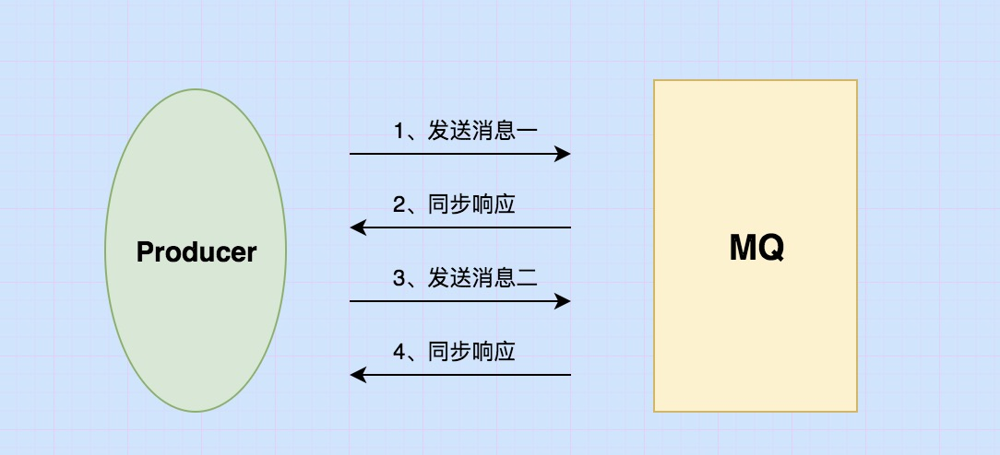
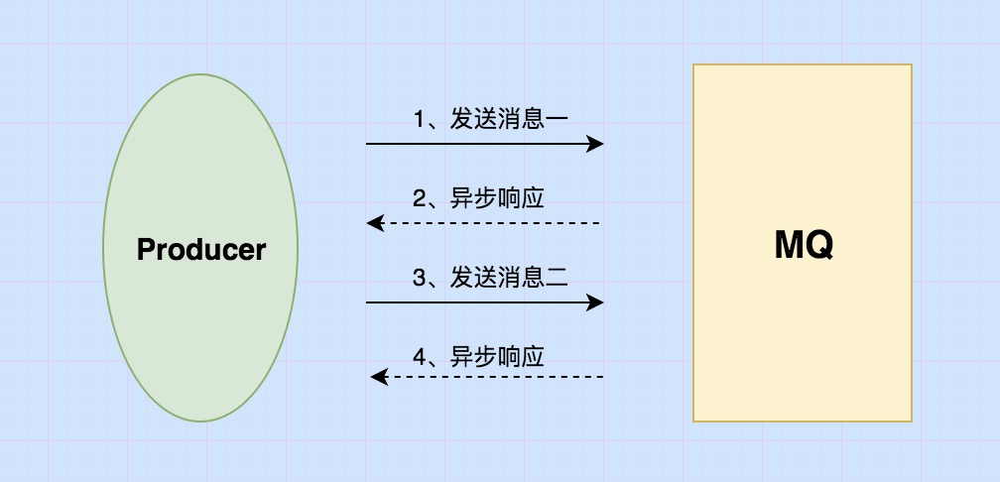
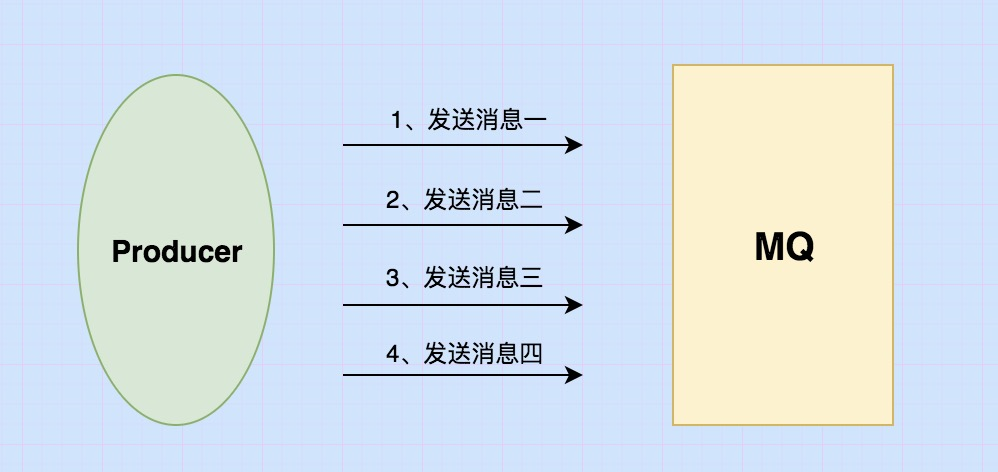

# 发送普通消息
>RocketMQ 发送普通消息有三种实现方式：`可靠同步发送`、`可靠异步发送`、`单向（Oneway）发送`。
注意 ：顺序消息只支持可靠同步发送。

[[TOC]]

## 概念

### 可靠同步发送

**原理**：同步发送是指消息发送方发出数据后，会在收到接收方发回响应之后才发下一个数据包的通讯方式。 

`应用场景`：此种方式应用场景非常广泛，例如重要通知邮件、报名短信通知、营销短信系统等。

### 可靠异步发送

**原理**:异步发送是指发送方发出数据后，不等接收方发回响应，接着发送下个数据包的通讯方式。 消息队列 RocketMQ 的异步发送，
需要用户实现异步发送回调接口（SendCallback）。

`应用场景`：异步发送一般用于链路耗时较长，对 RT 响应时间较为敏感的业务场景，例如批量发货等操作,用户视频上传后通知启动转码服务，转码完成后通知推送转码结果等。

### 单向（Oneway）发送

**原理**：原理：单向（Oneway）发送特点为发送方只负责发送消息，不等待服务器回应且没有回调函数触发，即只发送请求不等待应答。
 此方式发送消息的过程耗时非常短，一般在微秒级别。

`应用场景`：适用于某些耗时非常短，但对可靠性要求并不高的场景，例如日志收集。

### 三种对比

下表概括了三者的特点和主要区别。
发送方式|发送 TPS|发送结果反馈|可靠性|
---|:--:|---:|---:|
同步发送|快|有|不丢失|
异步发送|快|有|不丢失|
单向发送|最快|无|可能丢失|
