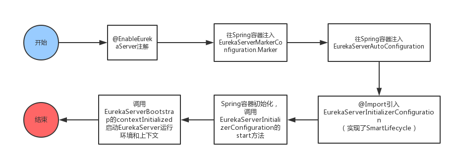

# SpringCloud 涉及到的有关注解

[[TOC]]

## @EnableEurekaServer

## @EnableEurekaClient

EurekaDiscoveryClient注入,继而使用NetFlix提供的Eureka client。

## @EnableWebSecurity

## @Configuration

@Configuration注解表示这是一个配置类，通过@Bean注解声明一些注入到Spring IOC容器中的Bean。

## @ConditionalOnBean(EurekaServerMarkerConfiguration.Marker.class)

表示只要Spring容器中有EurekaServerMarkerConfiguration.Marker.class类的实例存在，那么就会将这个EurekaServerAutoConfiguration也注入到Spring容器中。

## @Import(EurekaServerInitializerConfiguration.class)

表明它导入了EurekaServerInitializerConfiguration这个类。

## @PostConstruct
 
Servlet中增加了两个影响Servlet生命周期的注解，@PostConstruct和@PreDestroy，这两个注解被用来修饰一个非静态的void（）方法。

被@PostConstruct修饰的方法会在服务器加载Servlet的时候运行，并且只会被服务器执行一次。PostConstruct在构造函数之后执行，init（）方法之前执行。PreDestroy（）方法在destroy（）方法执行之后执行

@PostConstruct注解的方法将会在依赖注入完成后被自动调用。

Constructor >> @Autowired >> @PostConstruct

## @Value 

value注解的使用方式：@Value(value = “${user.userName}”)，这个时候就会把配置文件里的user.userName的值赋值给变量userName 

@Value将外部的值动态注入到Bean中

## @RestController

## @GetMapping

## @PostMapping

## @RequestBody

## @RequestParam

## @PathVariable

## @Bean

# Ribbon

## @LoadBalanced

使用@LoadBalanced注解赋予RestTemplate负载均衡的能力

---

## Hystrix

### @WebFilter

### @HystrixCommand

@HystrixCommand中的常用参数

fallbackMethod：指定服务降级处理方法；
ignoreExceptions：忽略某些异常，不发生服务降级；
commandKey：命令名称，用于区分不同的命令；
groupKey：分组名称，Hystrix会根据不同的分组来统计命令的告警及仪表盘信息；
threadPoolKey：线程池名称，用于划分线程池。

### @EnableCircuitBreaker

### @CacheResult

@CacheResult：开启缓存，默认所有参数作为缓存的key，cacheKeyMethod可以通过返回String类型的方法指定key；

### @CacheKey

@CacheKey：指定缓存的key，可以指定参数或指定参数中的属性值为缓存key，cacheKeyMethod还可以通过返回String类型的方法指定；

### @CacheRemove

@CacheRemove：移除缓存，需要指定commandKey。

### @HystrixCollapser

@HystrixCollapser的常用属性

- batchMethod：用于设置请求合并的方法；

- collapserProperties：请求合并属性，用于控制实例属性，有很多；

- timerDelayInMilliseconds：collapserProperties中的属性，用于控制每隔多少时间合并一次请求；

### @HystrixProperty

---

### @EnableHystrixDashboard

### @EnableTurbine

---

## OpenFeign

### @EnableFeignClients

注解@EnableFeignClients:扫描和注册feign客户端bean定义

### @FeignClient

使用注解@FeignClient 定义feign客户端

---

## Zuul

### @EnableZuulProxy

## Config

### @EnableConfigServer

### @RefreshScope

@RefreshScope注解用于刷新配置

