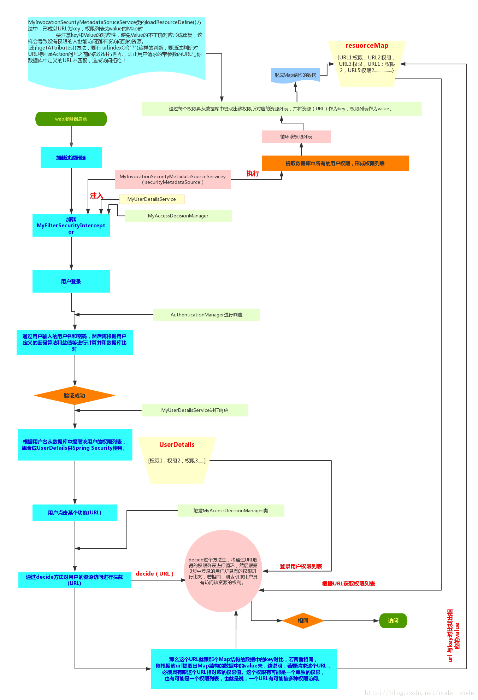

# 认证+授权代码实现
>Spring Security是**一种基于 Spring AOP 和 Servlet 过滤器的安全框架。**
>它提供全面的安全性解决方案，同时在 Web 请求级和方法调用级处理身份确认和授权。

## SpringSecurity工作流程
网上找一张图，觉得画的挺好的，比较容易理解。不然换的是源码流程图很难去理解。

图片地址 : [地址](https://img2020.cnblogs.com/blog/1090617/202004/1090617-20200422201332158-1598457501.png) 可以单机放大看更加清楚

要想理解这张图建议看下这篇博客,因为这张图中需要自定义的My...类，在文章中都有说明，所以更好理解点。

[Spring Boot Security 详解](http://blog.itwolfed.com/blog/14)

